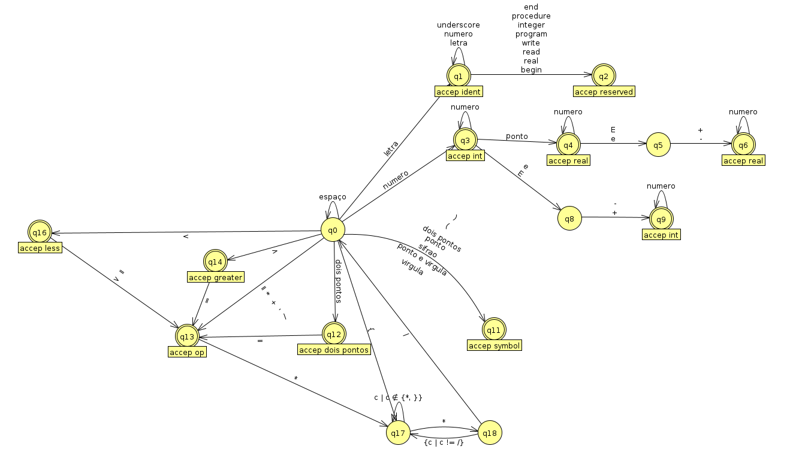

# Compilador 1 & 2
Frontend de compilador faltando faltando análise semântica, geração de código intermediário, código objeto para máquina hipotética e interpretador
Frontend de compilador faltando análise semântica e geração de código intermediário.
A ideia a princípio era fazer um compilador top-down iterativo de uma linguagem LL1. 
Porém, não deu, então fiz a análise sintática iterativa usando uma tabela de parse e a análise semântica usando recursão.
Uma escolha que se tornou um tanto quanto agradável, já que eu tinha sempre um nó para passar para um função e não precisava montar os token e analisar as regras semantias simultaneamente.
O compilador permite você ver a tal da árvore e ,ainda por cima, anotada. Olha só! É bom demais para acreditar né?

## TODO:

- [ ] terminar comp2
   - [x] atualizar conjuntos First e Follow
      - [x] documentar o que foi alterado
   - [x] atualizar tabela de parse
   - [x] atualizar regras semanticas
   - [ ] implementar conversor de quadrupla pra código objeto de máquina hipotética
- [ ] fazer umas mensagens de erro melhores
- [ ] remover coisas inúteis do código como o id dos tokens já que o parse é feito diretamente comparando o próprio lexema
   - [ ] ver se tem como otimizar o parsing ou a análise semantica implementando ids para os tokens apropriadamente
- [ ] arrumar documentação
   - [ ] automato não reconhece lexemas relativos a expressões condicionais como if, else, then, while e etc
   - [ ] uml desatualizado

---

# Build
```
mkdir build
make
make run
```
caso necessário por motivos de debug ou qualquer outra coisa
```
make && make run > output
```
# Gramática
```
Especificação da Sintaxe da Linguagem LALG
- Comentários na LALG: entre { } ou /* */


<programa> -> program ident <corpo> .
<corpo> -> <dc> begin <comandos> end
<dc> -> <dc_v> <mais_dc> | <dc_p> | λ
<mais_dc> -> ; <dc> | λ
<dc_v> ->  <tipo_var> : <variaveis>
<tipo_var> -> real | integer
<variaveis> -> ident <mais_var>
<mais_var> -> , <variaveis> | λ
<dc_p> -> procedure ident <parametros> <corpo_p>
<parametros> -> (<lista_par>) | λ
<lista_par> -> <tipo_var> : <variaveis> <mais_par>
<mais_par> -> ; <lista_par> | λ
<corpo_p> -> <dc_loc> begin <comandos> end
<dc_loc> -> <dc_v> <mais_dcloc> | λ
<mais_dcloc> -> ; <dc_loc> | λ
<lista_arg> -> (<argumentos>) | λ
<argumentos> -> ident <mais_ident>
<mais_ident> -> , <argumentos> | λ
<comandos> -> <comando> <mais_comandos>
<mais_comandos> -> ; <comandos> | λ

<comando> -> read (ident) |
						 write (ident) |
						 if <condicao> then <comandos> <pfalsa> $ |
						 while <condicao> do <comandos> $ |
						 ident <restoIdent>
							
<restoIdent> -> := <expressao> | <lista_arg>
<condicao> -> <expressao> <relacao> <expressao>
<relacao> -> = | <> | >= | <= | > | <
<expressao> -> <termo> <outros_termos>
<termo> -> <op_un> <fator> <mais_fatores>
<op_un> -> - | λ
<fator> -> ident | numero_int | numero_real | (<expressao>)
<outros_termos> -> <op_ad> <termo> <outros_termos> | λ
<op_ad> -> + | -
<mais_fatores> -> <op_mul> <fator> <mais_fatores> | λ
<op_mul> -> * | /
<pfalsa> -> else <comandos> | λ
```

# Diagrama de transição


# Conjuntos First e Follow
```
First(<programa>) = {program}
First(<corpo>) = First(<dc>) U {begin} # <dc> can be null
                 First(<dc_v>) 
                 First(<tipo_var>)
                 {real, integer, begin}
First(<dc>) = First(<dc_v>) U First(<dc_p>) U {&}
              First(<tipo_var>) U {procedure} U {&}
              {real, integer, procedure, &}
First(<mais_dc>) = {;, &}
First(<dc_v>) = First(<tipo_var>)
                {real, integer}
First(<tipo_var>) = {real, integer}
First(<variaveis>) = {ident}
First(<mais_var>) = {,, &} #primeira vírgula é terminal
First(<dc_p>) = {procedure}
First(<parametros>) = {(} U {&}
                      {(, &}
First(<lista_par>) = First(<tipo_var>)
                     {real, integer}
First(<mais_par>) = {;} U {&}
                    {;, &}
First(<corpo_p>) = First(<dc_loc>) U {begin} # <dc_loc> can be null
                   {real, integer, begin}
First(<dc_loc>) = First(<dc_v>) U {&}
                  {real, integer, &}
First(<mais_dcloc>) = {;, &}
First(<lista_arg>) = {(} U {&}
                     {(, &}
First(<argumentos>) = {ident}
First(<mais_ident>) = {,} U {&}
                      {, &}
First(<comandos>) = First(<comando>)
                    {read, write, ident, if}
First(<mais_comandos>) = {;, &}
First(<comando>) = {read} U {write} U {if} U {while} U {ident}
                   {read, write, if, while, ident}
First(<restoIdent>) = {:=} U First(<lista_arg>)
                      {:=} U {(, &}
                      {:=, (, &}
First(<condicao>) = First(<expressao>)
                    First(<termo>)
                    First(<op_un>) U First(<fator>)
                    {-, ident, numero_int, numero_real, (}
First(<relacao>) = {=, <>, >=, <=, >, <}
First(<expressao>) = First(<termo>)
                     First(<op_un>) U First(<fator>) 
                     {-, ident, numero_int, numero_real, (}
First(<termo>) = First(<op_un>) U First(<fator>)
                 {-, ident, numero_int, numero_real, (}
First(<op_un>) = {-, &}
First(<fator>) = {ident, numero_int, numero_real, (}
First(<outros_termos>) = First(op_ad)
                         {+, -, &}
First(<op_ad>) = {+, -}
First(<mais_fatores>) = First(<op_mul>) U (&)
                        {*, /, &}
First(<op_mul>) = {*, /}
First(<pfalsa>) = {else, &}

Follow(<programa>) = {EOF}
Follow(<corpo>) = {.}
Follow(<dc>) = {begin} U Follow(<mais_dc>)
             = {begin} U Follow(<dc>)
             = {begin}
Follow(<mais_dc>) = Follow(<dc>)
                  = {begin}
Follow(<dc_v>) = First(<mais_dc>) U First(<mais_dcloc>)
               = {;, &} U Follow(<mais_dc>) U {;, &} U Follow(<mais_dcloc>)
               = {;, &} U Follow(<dc>) U {;, &} U {begin}
               = {;, begin} U {;, begin}
               = {;, begin}
Follow(<tipo_var>) = {:}
Follow(<variaveis>) = Follow(<dc_v>) U Follow(<mais_var>) U First(<mais_par>)
                    = {;, begin} U Follow(<variaveis>) U {;, &} U Follow(<mais_par>)
                    = {;, begin} U Follow(<mais_par>)
                    = {;, begin} U {)}
                    = {;, begin, )}
Follow(<mais_var>) = Follow(<variaveis>)
                   = {;, begin, )}
Follow(<dc_p>) = Follow(<dc>)
                 {begin}
Follow(<parametros>) = First(<corpo_p>)
                       {real, integer, &} U Follow(<corpo_p>)
                       {real, integer, &} U Follow(<dc_p>)
                       {real, integer, begin}
Follow(<lista_par>) = {)} U Follow(<mais_par>)
                      {)} U Follow(<lista_par>)
                      {)}
Follow(<mais_par>) = Follow(<lista_par>)
                     {)}
Follow(<corpo_p>) = Follow(<dc_p>)
                    {begin}
Follow(<dc_loc>) = {begin} U Follow(<mais_dcloc>)
                   {begin}
Follow(<mais_dcloc>) = Follow(<dc_loc>)
                       {begin}
Follow(<lista_arg>) = Follow(<restoIdent>)
                      {;, else, $, end}
Follow(<argumentos>) = {)} U Follow(<mais_ident>)
                       {)}
Follow(<mais_ident>) = Follow(<argumentos>)
                       {)}
Follow(<comandos>) = Follow(<mais_comandos>) U First(<pfalsa>) U Follow(<pfalsa>) U {end} U {$}
                   = Follow(<comandos>) U {else} U {$} U {end}
                   = {else, $, end}
Follow(<mais_comandos>) = Follow(<comandos>)
                        = {else, $, end}
Follow(<comando>) = First(<mais_comandos>)
                    {;, &} U Follow(<mais_comandos>)
                    {;, &} U {else, $, end}
                    {;, else, $, end}
Follow(<restoIdent>) = Follow(<comando>)
                       {;, else, $, end}
Follow(<condicao>) = {then, do}
Follow(<relacao>) = First(expressao)
                  = {-, ident, numero_int, numero_real, (}
Follow(<expressao>) = First(<relacao>) U Follow(<condicao>) U Follow(<comando>) U {)}
                    = {=, <>, >=, <=, >, <} U {then} U {;, else, $, end} U {)}
                    = {=, <>, >=, <=, >, <, then, do, ;, else, $, end, )}
Follow(<termo>) = First(<outros_termos>)
                = {+, -} U Follow(<outros_termos>)
                = {+, -, =, <>, >=, <=, >, <, then, do, ;, else, $, end, )}
Follow(<op_un>) = First(<fator>)
                = {ident, numero_int, numero_real, (}
Follow(<fator>) = First(<mais_fatores>)
                = {*, /}
Follow(<outros_termos>) = Follow(<expressao>)
                        = {=, <>, >=, <=, >, <, then, do, ;, else, $, end, )}
Follow(<op_ad>) = First(<termo>)
                = {-, ident, numero_int, numero_real, (}
Follow(<mais_fatores>) = Follow(<termo>)
                       = {+, -, =, <>, >=, <=, >, <, then, do, ;, else, $, end, )}
Follow(<op_mul>) = First(<fator>)
                 = {ident, numero_int, numero_real, (}
Follow(<pfalsa>) = {$}
```

# Tabela de parse
| NAO TERMINAL  | . | end                         | real                                               | integer                                            | read                                    | write                                   | if                                                    | (                                               | ident                                           | )                    | :=                             | ;                               | : | program                               | ","                              | then                 | $                           | =                    | <>                   | >=                   | <=                   | >                    | <                    | -                                                  | numero_int                                      | numero_real                                     | +                                                  | *                                                 | /                                                 | else                        | begin                                      | EOF | procedure                                        | while                                         | do |
|---------------|---|-----------------------------|----------------------------------------------------|----------------------------------------------------|-----------------------------------------|-----------------------------------------|-------------------------------------------------------|-------------------------------------------------|-------------------------------------------------|----------------------|--------------------------------|---------------------------------|---|---------------------------------------|----------------------------------|----------------------|-----------------------------|----------------------|----------------------|----------------------|----------------------|----------------------|----------------------|----------------------------------------------------|-------------------------------------------------|-------------------------------------------------|----------------------------------------------------|---------------------------------------------------|---------------------------------------------------|-----------------------------|--------------------------------------------|-----|--------------------------------------------------|-----------------------------------------------|----|
| programa      |   |                             |                                                    |                                                    |                                         |                                         |                                                       |                                                 |                                                 |                      |                                |                                 |   | <programa\> -> program ident <corpo\> . |                                  |                      |                             |                      |                      |                      |                      |                      |                      |                                                    |                                                 |                                                 |                                                    |                                                   |                                                   |                             |                                            |     |                                                  |                                               |    |
| corpo         |   |                             | <corpo\> -> <dc\> begin <comandos\> end               | <corpo\> -> <dc\> begin <comandos\> end               |                                         |                                         |                                                       |                                                 |                                                 |                      |                                |                                 |   |                                       |                                  |                      |                             |                      |                      |                      |                      |                      |                      |                                                    |                                                 |                                                 |                                                    |                                                   |                                                   |                             | <corpo\> -> <dc\> begin <comandos\> end       |     |                                                  |                                               |    |
| dc            |   |                             | <dc\> -> <dc_v\> <mais_dc\>                           | <dc\> -> <dc_v\> <mais_dc\>                           |                                         |                                         |                                                       |                                                 |                                                 |                      |                                | <dc\> -> λ                       |   |                                       |                                  |                      |                             |                      |                      |                      |                      |                      |                      |                                                    |                                                 |                                                 |                                                    |                                                   |                                                   |                             | <dc\> -> λ                                  |     | <dc\> -> <dc_p\>                                   |                                               |    |
| mais_dc       |   |                             |                                                    |                                                    |                                         |                                         |                                                       |                                                 |                                                 |                      |                                | <mais_dc\> -> ; <dc\>             |   |                                       |                                  |                      |                             |                      |                      |                      |                      |                      |                      |                                                    |                                                 |                                                 |                                                    |                                                   |                                                   |                             | <mais_dc\> -> λ                             |     |                                                  |                                               |    |
| dc_v          |   |                             | <dc_v\> ->  <tipo_var\> : <variaveis\>                | <dc_v\> ->  <tipo_var\> : <variaveis\>                |                                         |                                         |                                                       |                                                 |                                                 |                      |                                |                                 |   |                                       |                                  |                      |                             |                      |                      |                      |                      |                      |                      |                                                    |                                                 |                                                 |                                                    |                                                   |                                                   |                             |                                            |     |                                                  |                                               |    |
| tipo_var      |   |                             | <tipo_var\> -> real                                 | <tipo_var\> -> integer                              |                                         |                                         |                                                       |                                                 |                                                 |                      |                                |                                 |   |                                       |                                  |                      |                             |                      |                      |                      |                      |                      |                      |                                                    |                                                 |                                                 |                                                    |                                                   |                                                   |                             |                                            |     |                                                  |                                               |    |
| variaveis     |   |                             |                                                    |                                                    |                                         |                                         |                                                       |                                                 | <variaveis\> -> ident <mais_var\>                 |                      |                                |                                 |   |                                       |                                  |                      |                             |                      |                      |                      |                      |                      |                      |                                                    |                                                 |                                                 |                                                    |                                                   |                                                   |                             |                                            |     |                                                  |                                               |    |
| mais_var      |   |                             |                                                    |                                                    |                                         |                                         |                                                       |                                                 |                                                 | <mais_var\> -> λ      |                                | <mais_var\> -> λ                 |   |                                       | "<mais_var\> -> , <variaveis\>"    |                      |                             |                      |                      |                      |                      |                      |                      |                                                    |                                                 |                                                 |                                                    |                                                   |                                                   |                             | <mais_var\> -> λ                            |     |                                                  |                                               |    |
| dc_p          |   |                             |                                                    |                                                    |                                         |                                         |                                                       |                                                 |                                                 |                      |                                |                                 |   |                                       |                                  |                      |                             |                      |                      |                      |                      |                      |                      |                                                    |                                                 |                                                 |                                                    |                                                   |                                                   |                             |                                            |     | <dc_p\> -> procedure ident <parametros\> <corpo_p\> |                                               |    |
| parametros    |   |                             | <parametros\> -> λ                                  | <parametros\> -> λ                                  |                                         |                                         |                                                       | <parametros\> -> (<lista_par\>)                   |                                                 |                      |                                |                                 |   |                                       |                                  |                      |                             |                      |                      |                      |                      |                      |                      |                                                    |                                                 |                                                 |                                                    |                                                   |                                                   |                             | <parametros\> -> λ                          |     |                                                  |                                               |    |
| lista_par     |   |                             | <lista_par\> -> <tipo_var\> : <variaveis\> <mais_par\> | <lista_par\> -> <tipo_var\> : <variaveis\> <mais_par\> |                                         |                                         |                                                       |                                                 |                                                 |                      |                                |                                 |   |                                       |                                  |                      |                             |                      |                      |                      |                      |                      |                      |                                                    |                                                 |                                                 |                                                    |                                                   |                                                   |                             |                                            |     |                                                  |                                               |    |
| mais_par      |   |                             |                                                    |                                                    |                                         |                                         |                                                       |                                                 |                                                 | <mais_par\> -> λ      |                                | <mais_par\> -> ; <lista_par\>     |   |                                       |                                  |                      |                             |                      |                      |                      |                      |                      |                      |                                                    |                                                 |                                                 |                                                    |                                                   |                                                   |                             |                                            |     |                                                  |                                               |    |
| corpo_p       |   |                             | <corpo_p\> -> <dc_loc\> begin <comandos\> end         | <corpo_p\> -> <dc_loc\> begin <comandos\> end         |                                         |                                         |                                                       |                                                 |                                                 |                      |                                |                                 |   |                                       |                                  |                      |                             |                      |                      |                      |                      |                      |                      |                                                    |                                                 |                                                 |                                                    |                                                   |                                                   |                             | <corpo_p\> -> <dc_loc\> begin <comandos\> end |     |                                                  |                                               |    |
| dc_loc        |   |                             | <dc_loc\> -> <dc_v\> <mais_dcloc\>                    | <dc_loc\> -> <dc_v\> <mais_dcloc\>                    |                                         |                                         |                                                       |                                                 |                                                 |                      |                                |                                 |   |                                       |                                  |                      |                             |                      |                      |                      |                      |                      |                      |                                                    |                                                 |                                                 |                                                    |                                                   |                                                   |                             | <dc_loc\> -> λ                              |     |                                                  |                                               |    |
| mais_dcloc    |   |                             |                                                    |                                                    |                                         |                                         |                                                       |                                                 |                                                 |                      |                                | <mais_dcloc\> -> ; <dc_loc\>      |   |                                       |                                  |                      |                             |                      |                      |                      |                      |                      |                      |                                                    |                                                 |                                                 |                                                    |                                                   |                                                   |                             | <mais_dcloc\> -> λ                          |     |                                                  |                                               |    |
| lista_arg     |   | <lista_arg\> -> λ            |                                                    |                                                    |                                         |                                         |                                                       | <lista_arg\> -> (<argumentos\>)                   |                                                 |                      |                                | <lista_arg\> -> λ                |   |                                       |                                  |                      | <lista_arg\> -> λ            |                      |                      |                      |                      |                      |                      |                                                    |                                                 |                                                 |                                                    |                                                   |                                                   | <lista_arg\> -> λ            |                                            |     |                                                  |                                               |    |
| argumentos    |   |                             |                                                    |                                                    |                                         |                                         |                                                       |                                                 | <argumentos\> -> ident <mais_ident\>              |                      |                                |                                 |   |                                       |                                  |                      |                             |                      |                      |                      |                      |                      |                      |                                                    |                                                 |                                                 |                                                    |                                                   |                                                   |                             |                                            |     |                                                  |                                               |    |
| mais_ident    |   |                             |                                                    |                                                    |                                         |                                         |                                                       |                                                 |                                                 | <mais_ident\> -> λ    |                                |                                 |   |                                       | "<mais_ident\> -> , <argumentos\>" |                      |                             |                      |                      |                      |                      |                      |                      |                                                    |                                                 |                                                 |                                                    |                                                   |                                                   |                             |                                            |     |                                                  |                                               |    |
| comandos      |   |                             |                                                    |                                                    | <comandos\> -> <comando\> <mais_comandos\> | <comandos\> -> <comando\> <mais_comandos\> | <comandos\> -> <comando\> <mais_comandos\>               |                                                 | <comandos\> -> <comando\> <mais_comandos\>         |                      |                                |                                 |   |                                       |                                  |                      |                             |                      |                      |                      |                      |                      |                      |                                                    |                                                 |                                                 |                                                    |                                                   |                                                   |                             |                                            |     |                                                  | <comandos\> -> <comando\> <mais_comandos\>       |    |
| mais_comandos |   | <mais_comandos\> -> λ        |                                                    |                                                    |                                         |                                         |                                                       |                                                 |                                                 |                      |                                | <mais_comandos\> -> ; <comandos\> |   |                                       |                                  |                      | <mais_comandos\> -> λ        |                      |                      |                      |                      |                      |                      |                                                    |                                                 |                                                 |                                                    |                                                   |                                                   | <mais_comandos\> -> λ        |                                            |     |                                                  |                                               |    |
| comando       |   |                             |                                                    |                                                    | <comando\> -> read (ident)               | <comando\> -> write (ident)              | <comando\> -> if <condicao\> then <comandos\> <pfalsa\> $ |                                                 | <comando\> -> ident <restoIdent\>                 |                      |                                |                                 |   |                                       |                                  |                      |                             |                      |                      |                      |                      |                      |                      |                                                    |                                                 |                                                 |                                                    |                                                   |                                                   |                             |                                            |     |                                                  | <comando\> -> while <condicao\> do <comandos\> $ |    |
| restoIdent    |   | <restoIdent\> -> <lista_arg\> |                                                    |                                                    |                                         |                                         |                                                       | <restoIdent\> -> <lista_arg\>                     |                                                 |                      | <restoIdent\> -> := <expressao\> | <restoIdent\> -> <lista_arg\>     |   |                                       |                                  |                      | <restoIdent\> -> <lista_arg\> |                      |                      |                      |                      |                      |                      |                                                    |                                                 |                                                 |                                                    |                                                   |                                                   | <restoIdent\> -> <lista_arg\> |                                            |     |                                                  |                                               |    |
| condicao      |   |                             |                                                    |                                                    |                                         |                                         |                                                       | <condicao\> -> <expressao\> <relacao\> <expressao\> | <condicao\> -> <expressao\> <relacao\> <expressao\> |                      |                                |                                 |   |                                       |                                  |                      |                             |                      |                      |                      |                      |                      |                      | <condicao\> -> <expressao\> <relacao\> <expressao\>    | <condicao\> -> <expressao\> <relacao\> <expressao\> | <condicao\> -> <expressao\> <relacao\> <expressao\> |                                                    |                                                   |                                                   |                             |                                            |     |                                                  |                                               |    |
| relacao       |   |                             |                                                    |                                                    |                                         |                                         |                                                       |                                                 |                                                 |                      |                                |                                 |   |                                       |                                  |                      |                             | <relacao\> -> =       | <relacao\> -> <>      | <relacao\> -> >=      | <relacao\> -> <=      | <relacao\> -> >       | <relacao\> -> <       |                                                    |                                                 |                                                 |                                                    |                                                   |                                                   |                             |                                            |     |                                                  |                                               |    |
| expressao     |   |                             |                                                    |                                                    |                                         |                                         |                                                       | <expressao\> -> <termo\> <outros_termos\>          | <expressao\> -> <termo\> <outros_termos\>          |                      |                                |                                 |   |                                       |                                  |                      |                             |                      |                      |                      |                      |                      |                      | <expressao\> -> <termo\> <outros_termos\>             | <expressao\> -> <termo\> <outros_termos\>          | <expressao\> -> <termo\> <outros_termos\>          |                                                    |                                                   |                                                   |                             |                                            |     |                                                  |                                               |    |
| termo         |   |                             |                                                    |                                                    |                                         |                                         |                                                       | <termo\> -> <op_un\> <fator\> <mais_fatores\>       | <termo\> -> <op_un\> <fator\> <mais_fatores\>       |                      |                                |                                 |   |                                       |                                  |                      |                             |                      |                      |                      |                      |                      |                      | <termo\> -> <op_un\> <fator\> <mais_fatores\>          | <termo\> -> <op_un\> <fator\> <mais_fatores\>       | <termo\> -> <op_un\> <fator\> <mais_fatores\>       |                                                    |                                                   |                                                   |                             |                                            |     |                                                  |                                               |    |
| op_un         |   |                             |                                                    |                                                    |                                         |                                         |                                                       | <op_un\> -> λ                                    | <op_un\> -> λ                                    |                      |                                |                                 |   |                                       |                                  |                      |                             |                      |                      |                      |                      |                      |                      | <op_un\> -> -                                       | <op_un\> -> λ                                    | <op_un\> -> λ                                    |                                                    |                                                   |                                                   |                             |                                            |     |                                                  |                                               |    |
| fator         |   |                             |                                                    |                                                    |                                         |                                         |                                                       | <fator\> -> (<expressao\>)                        | <fator\> -> ident                                |                      |                                |                                 |   |                                       |                                  |                      |                             |                      |                      |                      |                      |                      |                      |                                                    | <fator\> -> numero_int                           | <fator\> -> numero_real                          |                                                    |                                                   |                                                   |                             |                                            |     |                                                  |                                               |    |
| outros_termos |   | <outros_termos\> -> λ        |                                                    |                                                    |                                         |                                         |                                                       |                                                 |                                                 | <outros_termos\> -> λ |                                | <outros_termos\> -> λ            |   |                                       |                                  | <outros_termos\> -> λ | <outros_termos\> -> λ        | <outros_termos\> -> λ | <outros_termos\> -> λ | <outros_termos\> -> λ | <outros_termos\> -> λ | <outros_termos\> -> λ | <outros_termos\> -> λ | <outros_termos\> -> <op_ad\> <termo\> <outros_termos\> |                                                 |                                                 | <outros_termos\> -> <op_ad\> <termo\> <outros_termos\> |                                                   |                                                   | <outros_termos\> -> λ        |                                            |     |                                                  |                                               |    |
| op_ad         |   |                             |                                                    |                                                    |                                         |                                         |                                                       |                                                 |                                                 |                      |                                |                                 |   |                                       |                                  |                      |                             |                      |                      |                      |                      |                      |                      | <op_ad\> -> -                                       |                                                 |                                                 | <op_ad\> -> +                                       |                                                   |                                                   |                             |                                            |     |                                                  |                                               |    |
| mais_fatores  |   | <mais_fatores\> -> λ         |                                                    |                                                    |                                         |                                         |                                                       |                                                 |                                                 | <mais_fatores\> -> λ  |                                | <mais_fatores\> -> λ             |   |                                       |                                  | <mais_fatores\> -> λ  | <mais_fatores\> -> λ         | <mais_fatores\> -> λ  | <mais_fatores\> -> λ  | <mais_fatores\> -> λ  | <mais_fatores\> -> λ  | <mais_fatores\> -> λ  | <mais_fatores\> -> λ  | <mais_fatores\> -> λ                                |                                                 |                                                 | <mais_fatores\> -> λ                                | <mais_fatores\> -> <op_mul\> <fator\> <mais_fatores\> | <mais_fatores\> -> <op_mul\> <fator\> <mais_fatores\> | <mais_fatores\> -> λ         |                                            |     |                                                  |                                               |    |
| op_mul        |   |                             |                                                    |                                                    |                                         |                                         |                                                       |                                                 |                                                 |                      |                                |                                 |   |                                       |                                  |                      |                             |                      |                      |                      |                      |                      |                      |                                                    |                                                 |                                                 |                                                    | <op_mul\> -> *                                     | <op_mul\> -> /                                     |                             |                                            |     |                                                  |                                               |    |
| pfalsa        |   |                             |                                                    |                                                    |                                         |                                         |                                                       |                                                 |                                                 |                      |                                |                                 |   |                                       |                                  |                      | <pfalsa\> -> λ               |                      |                      |                      |                      |                      |                      |                                                    |                                                 |                                                 |                                                    |                                                   |                                                   | <pfalsa\> -> else <comandos\> |                                            |     |                                                  |                                               |    |


# Regras semânticas
```
Legenda de Atibutos:
inh = herdado
syn = sintentizado
lexval = valor em string do lexema do token do nó atual
end_loc = linha da última instrução em endereço de três operandos
cond_loc = linha da instrução de jump JF
goto_loc = linha da instrução de goto, existe somente se o if tem um else
left_op = operador esquerdo
right_op = operador direito
op = operador
cond_begin = linha de instrução do início da expressão usada na condição

outros:
last_instruction_line = última linha do gerador de código

Alterações:
<dc>
<dc_p>
<parametros>
<lista_par>
<variaveis>
<mais_var>

<programa> -> program ident <corpo> .

{
   new Scope("main") 
   new codeGen("main")
   <dc>.scope = "main"
}
<corpo> ->  <dc>
            begin { 
                     <comandos>.scope = <dc>.scope 
                     codeGen = codeGen["main"]
                  }
            <comandos> { addCode("PARA", "", "", "") }
            end

{    
   <dc_v>.inh = <dc>.scope
   <mais_dc>.scope = <dc>.scope
}
<dc> -> { codeGen = codeGen["main"] }
        <dc_v> <mais_dc>
<dc> -> <dc_p>
<dc> -> λ

<mais_dc> -> ; { <mais_dc>.scope = <dc>.scope }
             <dc>
<mais_dc> -> λ

.inh
<dc_v> ->  <tipo_var> { <variaveis>.inh = <tipo_var>.syn }
           :          { <variaveis>.scope = <dc_v>.inh }
           <variaveis>

<tipo_var> -> real {<tipo_var>.syn = "real"}
<tipo_var> -> integer {<tipo_var>.syn = "integer"}

.scope
.inh (type)
.args (optional)
<variaveis> -> ident {
                        [<variaveis>.scope]->addEntry(ident.syn, <variaveis>.inh);
                        
                        if (<variaveis>.scope != "main" && <variaveis>.args == "true")
                           addArgs(<variaveis>.scope, symbol(ident.syn, <variaveis>.inh))
                        
                        addCode("ALME", "0.0", "", <variaveis>.scope + "_" + ident.syn);
                        
                        <mais_var>.inh = <variaveis>.inh
                        <mais_var>.scope = <variaveis>.scope
                        <mais_var>.args = <variaveis>.args
                     }
               <mais_var>

.scope
<mais_var> -> , {
                  <variaveis>.inh = <mais_var>.inh
                  <variaveis>.scope = <mais_var>.scope
                  <variaveis>.args = <mais_var>.args
                }
              <variaveis>
<mais_var> -> λ

<dc_p> -> procedure
          ident { 
                  <dc_p>.scope = ident.syn
                  new Scope(<dc_p>.scope)
                  new codeGen(<dc_p>.scope)
                  codeGen = codeGen[<dc_p>.scope]
                  <parametros>.inh = <dc_p>.scope
                }
         <parametros> { <corpo_p>.scope = <parametros>.inh }
         <corpo_p> { eraseScope(<dc_p>.scope) }

.inh
<parametros> -> ( { <lista_par>.scope = <parametros>.inh }
                <lista_par>
                )
<parametros> -> λ

.scope
<lista_par> -> <tipo_var> {
                              <variaveis>.inh = <tipo_var>.syn
                              <variaveis>.scope = <lista_par>.scope
                              <variaveis>.args = "true"
                          }
               : 
               <variaveis> { <mais_par>.scope = <variaveis>.scope }
               <mais_par>

.scope
<mais_par> -> ; { <lista_par>.scope = <mais_par>.scope }
              <lista_par>
<mais_par> -> λ

.scope
<corpo_p> -> { <dc_loc>.scope = <corpo_p>.scope }
            <dc_loc> 
             begin { <comandos>.scope = <corpo_p>.scope }
             <comandos>
             end

.scope
<dc_loc> -> { <dc_v>.inh = <dc_loc>.scope }
            <dc_v> { <mais_dcloc>.scope = <dc_loc>.scope }
            <mais_dcloc>
<dc_loc> -> λ

<mais_dcloc> -> ; 
                <dc_loc>
<mais_dcloc> -> λ

.outer_scope
.inner_scope
<lista_arg> -> ( { 
                     <argumentos>.outer_scope = <lista_arg>.outer_scope 
                     <argumentos>.inner_scope = <lista_arg>.inner_scope
                     <argumentos>.counter = 0
                 }
               <argumentos> { <lista_arg>.end_loc = <argumentos>.end_loc }
               )
<lista_arg> -> λ { <lista_arg>.end_loc = last_instruction_line }

.outer_scope
.inner_scope
.counter
<argumentos> -> ident {
                        if (check(ident) && ident.syn.type == args[<argumentos>.counter].type)
                        {
                           addCode(":=", ident.val, "", args[<argumentos>.counter])
                           <argumentos>.counter += 1
                           <mais_ident>.counter = <argumentos>.counter
                        }
                        else
                        {
                           erro()
                        }
                      }
                <mais_ident>

.outer_scope
.inner_scope
.counter
<mais_ident> -> , { 
                     <argumentos>.outer_scope = <mais_ident>.outer_scope
                     <argumentos>.inner_scope = <mais_ident>.inner_scope
                     <argumentos>.counter = <mais_ident>.counter
                  }
                <argumentos>
<mais_ident> -> λ

.scope
<comandos> ->  { <comando>.scope = <comandos>.scope }
               <comando> { 
                           <mais_comandos>.inh = <comando>.end_loc 
                           <mais_comandos>.scope = <comandos>.scope
                         }
               <mais_comandos> { <comandos>.end_loc = <mais_comandos>.end_loc }

<mais_comandos> -> { <comandos>.scope = <mais_comandos>.scope }
                   ; <comandos> { <mais_comandos>.end_loc = <comandos>.end_loc }
<mais_comandos> -> λ { <mais_comandos>.end_loc = <mais_comandos>.inh }

.scope
<comando> -> read (ident) {
                              <comando>.end_loc = addCode("read", "", "", ident.syn)
                          }
<comando> -> write (ident) {
                              <comando>.end_loc = addCode("write", "", "", ident.syn)
                           }
<comando> -> {<condicao>.scope = <comando>.scope }
             if <condicao> then { <comandos>.scope = <comando>.scope }
               <comandos>  { 
                              if (<pfalsa>->child(0) == "else")
                                 <condicao>.goto_loc = addCode("goto", last_instruction_line, "", "")
                              <pfalsa>.inh = last_instruction_line
                              <pfalsa>.scope = <scomando>.scope
                           }
               <pfalsa> $
<comando> -> { <comando>.cond_begin = last_instruction_line }
             while { <condicao>.scope = <comando>.scope }
             <condicao> 
             do { <comandos>.scope = <comando>.scope }
             <comandos> { 
                           addCode("goto", <comando>.cond_begin, "", "")
                           
                        }
             $
<comando> -> ident { 
                     <restoIdent>.scope = <comando>.scope 
                     <restoIdent>.ident = ident.syn
                   }
             <restoIdent> { <comando>.end_loc = <restoIdent>.end_loc }

.scope
.ident
<restoIdent> -> { <expressao>.scope = <restoIdent>.scope }
                := <expressao> {
                                  if(<expressao>.syn.type == <restoIdent>.ident.type)
                                  {
                                     ident.val = <expressao>.syn.val
                                     <restoIdent>.end_loc = addCode(":=", ident.val, "",)
                                  }
                                  else {
                                     erro();
                                  }
                               }
{
   <lista_arg>.outer_scope = <restoIdent>.scope
   <lista_arg>.inner_scope = <restoIdent>.ident
}
<restoIdent> -> <lista_arg> { 
                              <restoIdent>.end_loc = <lista_arg>.end_loc 
                              eraseScope(<restoIdent>.ident)
                            }

.scope
<condicao> ->  { <expressao>.scope = <condicao>.scope }
               <expressao> { <condicao>.left_op = <expressao>.syn }
               <relacao> { <condicao>.rel_op = <relacao>.lexval }
               <expressao> { 
                              <condicao>.right_op = <expressao>.syn                               
                              <condicao>.cond_loc = addCode(<condicao>.rel_op, <condicao>.left_op, <condicao>.right_op, geraTemp())
                           }

.scope
<pfalsa> -> else { <comandos>.scope = <pfalsa>.scope }
            <comandos>
<pfalsa> -> λ

<relacao> -> = { <relaval>.lexval = "=" }
<relacao> -> <> { <relaval>.lexval = "<>" }
<relacao> -> >= { <relaval>.lexval = ">=" }
<relacao> -> <= { <relaval>.lexval = "<=" }
<relacao> -> > { <relaval>.lexval = ">" }
<relacao> -> < { <relaval>.lexval = "<" }

.scope
<expressao> -> { <termo>.scope = <expressao>.scope }
               <termo> { 
                           <outros_termos>.inh = <termo>.syn 
                           <outros_termos>.scope = <expressao>.scope
                       }
               <outros_termos> { <expressao>.syn = <outros_termos>.syn }

.scope
<termo> -> <op_un> { 
                     <fator>.inh = <op_un>.val
                     <fator>.scope = <termo>.scope
                   } 
           <fator> { 
                     <mais_fatores>.inh = <fator>.inh * <fator>.syn 
                     <mais_fatores>.scope = <termo>.scope
                   } 
           <mais_fatores> { <termo>.syn = <mais_fatores>.syn }

<op_un> -> - { <op_un>.val = "-" }
<op_un> -> λ { <op_un>.val = "" }

.scope
<fator> -> ident         { <fator>.syn = ident.syn }
<fator> -> numero_int    { <fator>.syn = numero_int.lexval }
<fator> -> numero_real   { <fator>.syn = numero_real.lexval }
<fator> -> { <expressao>.scope = <fator>.scope }
           (<expressao>) { <fator>.syn = <expressao>.syn }

.inh = <termo>.syn
<outros_termos> -> <op_ad> { 
                              <outros_termos>.op = <op_ad>.lexval
                              <termo>.scope = <outros_termos>.scope
                           }
                   <termo> { 
                              <outros_termos₁>.inh = <termo>.syn 
                              <outros_termo₁>.scope = <outros_termo>.scope
                           }
                   <outros_termos₁> {
                                       <outros_termos>.syn = geraTemp();
                                       addCode(<outros_termos>.op, <outros_termos>.inh, <outros_termos₁>.syn, <outros_termos>.syn)
                                    }
<outros_termos> -> λ { <outros_termos>.syn = <outros_termos>.inh }

<op_ad> -> + { <op_ad>.lexval = "+" }
<op_ad> -> - { <op_ad>.lexval = "-" }

.inh = <fator>.syn
<mais_fatores> -> <op_mul> { 
                              <mais_fatores>.op = <op_mul>.lexval 
                              <fator>.scope = <mais_fatores>.scope
                           }
                  <fator> { 
                              <mais_fatores₁>.inh = <fator>.syn 
                              <mais_fatores₁>.scope = <mais_fatores>.scope
                           }
                  <mais_fatores₁> {
                                    <mais_fatores>.syn = geraTemp();
                                    addCode(<mais_fatores>.op, <mais_fatores>.inh, <mais_fatores₁>.syn, <mais_fatores>.syn);
                                  }
<mais_fatores> -> λ { <mais_fatores>.syn = <mais_fatores>.inh }

<op_mul> -> * { op_mul.lexval = "*" }
<op_mul> -> / { op_mul.lexval = "/" }
```

# Output de exemplo a partir do input de exemplo
```
000| PROCEDURE|     main|       |        
001|      ALME|      0.0|       |  main_a
002|      ALME|      0.0|       |  main_b
003|      ALME|        0|       |  main_c
004|      ALME|        0|       |  main_d
005|      read|         |       |  main_a
006|      read|         |       |  main_c
007|         *|   main_a| main_a| main_t1
008|         +|  main_t1| main_a| main_t2
009|        :=|  main_t2|       |  main_b
010|         *|        2| main_c| main_t3
011|         +|  main_t3| main_c| main_t4
012|        :=|  main_t4|       |  main_d
013|         >|   main_a| main_b| main_t5
014|        JF|  main_t5|     17|        
015|     write|   main_a|       |        
016|      goto|       18|       |        
017|     write|   main_b|       |        
018| PROCEDURE|       um|       |        
019|      ALME|   main_a|       |    um_a
020|      ALME|   main_b|       |    um_g
021|      ALME|   main_c|       |    um_d
022|      ALME|   main_d|       |    um_c
023|      ALME|      0.0|       |    um_h
024|      ALME|      0.0|       |    um_i
025|      ALME|      0.0|       |    um_j
026|      ALME|        0|       |    um_l
027|        :=| 2.000000|       |    um_h
028|         /| 3.400000|   um_h|   um_t1
029|         +|     um_g|  um_t1|   um_t2
030|        :=|    um_t2|       |    um_a
031|         *|     um_d|      2|   um_t3
032|         -|     um_c|  um_t3|   um_t4
033|        :=|    um_t4|       |    um_l
034|         +|     um_c|   um_d|   um_t5
035|        >=|    um_t5|      5|   um_t6
036|        JF|    um_t6|     21|        
037|     write|     um_a|       |        
038|      goto|       22|       |        
039|     write|     um_l|       |        
040|      PARA|         |       |        
041|         <|   main_d| main_c| main_t6
042|        JF|  main_t6|     45|        
043|     write|   main_d|       |        
044|      goto|       46|       |        
045|     write|   main_c|       |        
046|         >|   main_a|      1| main_t7
047|        JF|  main_t7|     54|        
048|         <|   main_b|      2| main_t8
049|        JF|  main_t8|     53|        
050|         -|   main_a|      1| main_t9
051|        :=|  main_t9|       |  main_a
052|      goto|       48|       |        
053|      goto|       46|       |        
054|      PARA|         |       |        

```

# Árvore de parse anotada (gerada a partir input de exemplo)
obviamente as anotações seguem as regras semânticas
```
<programa>
|- program -> program
|- ident -> teste
|- <corpo>
|- |- <dc>
|- |- [attr] <dc>.scope = main (string)
|- |- |- <dc_v>
|- |- |- [attr] <dc_v>.inh = main (string)
|- |- |- |- <tipo_var>
|- |- |- |- [attr] <tipo_var>.syn = real (string)
|- |- |- |- |- real -> real
|- |- |- |- : -> :
|- |- |- |- <variaveis>
|- |- |- |- [attr] <variaveis>.args = {null} (string)
|- |- |- |- [attr] <variaveis>.inh = real (string)
|- |- |- |- [attr] <variaveis>.scope = main (string)
|- |- |- |- |- ident -> a
|- |- |- |- |- <mais_var>
|- |- |- |- |- [attr] <mais_var>.args = {null} (string)
|- |- |- |- |- [attr] <mais_var>.inh = real (string)
|- |- |- |- |- [attr] <mais_var>.scope = main (string)
|- |- |- |- |- |- , -> ,
|- |- |- |- |- |- <variaveis>
|- |- |- |- |- |- [attr] <variaveis>.args = {null} (string)
|- |- |- |- |- |- [attr] <variaveis>.inh = real (string)
|- |- |- |- |- |- [attr] <variaveis>.scope = main (string)
|- |- |- |- |- |- |- ident -> b
|- |- |- |- |- |- |- <mais_var>
|- |- |- |- |- |- |- [attr] <mais_var>.args = {null} (string)
|- |- |- |- |- |- |- [attr] <mais_var>.inh = real (string)
|- |- |- |- |- |- |- [attr] <mais_var>.scope = main (string)
|- |- |- |- |- |- |- |- &
|- |- |- <mais_dc>
|- |- |- [attr] <mais_dc>.scope = main (string)
|- |- |- |- ; -> ;
|- |- |- |- <dc>
|- |- |- |- [attr] <dc>.scope = main (string)
|- |- |- |- |- <dc_v>
|- |- |- |- |- [attr] <dc_v>.inh = main (string)
|- |- |- |- |- |- <tipo_var>
|- |- |- |- |- |- [attr] <tipo_var>.syn = integer (string)
|- |- |- |- |- |- |- integer -> integer
|- |- |- |- |- |- : -> :
|- |- |- |- |- |- <variaveis>
|- |- |- |- |- |- [attr] <variaveis>.args = {null} (string)
|- |- |- |- |- |- [attr] <variaveis>.inh = integer (string)
|- |- |- |- |- |- [attr] <variaveis>.scope = main (string)
|- |- |- |- |- |- |- ident -> c
|- |- |- |- |- |- |- <mais_var>
|- |- |- |- |- |- |- [attr] <mais_var>.args = {null} (string)
|- |- |- |- |- |- |- [attr] <mais_var>.inh = integer (string)
|- |- |- |- |- |- |- [attr] <mais_var>.scope = main (string)
|- |- |- |- |- |- |- |- , -> ,
|- |- |- |- |- |- |- |- <variaveis>
|- |- |- |- |- |- |- |- [attr] <variaveis>.args = {null} (string)
|- |- |- |- |- |- |- |- [attr] <variaveis>.inh = integer (string)
|- |- |- |- |- |- |- |- [attr] <variaveis>.scope = main (string)
|- |- |- |- |- |- |- |- |- ident -> d
|- |- |- |- |- |- |- |- |- <mais_var>
|- |- |- |- |- |- |- |- |- [attr] <mais_var>.args = {null} (string)
|- |- |- |- |- |- |- |- |- [attr] <mais_var>.inh = integer (string)
|- |- |- |- |- |- |- |- |- [attr] <mais_var>.scope = main (string)
|- |- |- |- |- |- |- |- |- |- &
|- |- |- |- |- <mais_dc>
|- |- |- |- |- [attr] <mais_dc>.scope = main (string)
|- |- |- |- |- |- ; -> ;
|- |- |- |- |- |- <dc>
|- |- |- |- |- |- [attr] <dc>.scope = main (string)
|- |- |- |- |- |- |- <dc_p>
|- |- |- |- |- |- |- [attr] <dc_p>.scope = um (string)
|- |- |- |- |- |- |- |- procedure -> procedure
|- |- |- |- |- |- |- |- ident -> um
|- |- |- |- |- |- |- |- <parametros>
|- |- |- |- |- |- |- |- [attr] <parametros>.inh = um (string)
|- |- |- |- |- |- |- |- |- ( -> (
|- |- |- |- |- |- |- |- |- <lista_par>
|- |- |- |- |- |- |- |- |- [attr] <lista_par>.scope = um (string)
|- |- |- |- |- |- |- |- |- |- <tipo_var>
|- |- |- |- |- |- |- |- |- |- [attr] <tipo_var>.syn = real (string)
|- |- |- |- |- |- |- |- |- |- |- real -> real
|- |- |- |- |- |- |- |- |- |- : -> :
|- |- |- |- |- |- |- |- |- |- <variaveis>
|- |- |- |- |- |- |- |- |- |- [attr] <variaveis>.args = true (string)
|- |- |- |- |- |- |- |- |- |- [attr] <variaveis>.inh = real (string)
|- |- |- |- |- |- |- |- |- |- [attr] <variaveis>.scope = um (string)
|- |- |- |- |- |- |- |- |- |- |- ident -> a
|- |- |- |- |- |- |- |- |- |- |- <mais_var>
|- |- |- |- |- |- |- |- |- |- |- [attr] <mais_var>.args = true (string)
|- |- |- |- |- |- |- |- |- |- |- [attr] <mais_var>.inh = real (string)
|- |- |- |- |- |- |- |- |- |- |- [attr] <mais_var>.scope = um (string)
|- |- |- |- |- |- |- |- |- |- |- |- , -> ,
|- |- |- |- |- |- |- |- |- |- |- |- <variaveis>
|- |- |- |- |- |- |- |- |- |- |- |- [attr] <variaveis>.args = true (string)
|- |- |- |- |- |- |- |- |- |- |- |- [attr] <variaveis>.inh = real (string)
|- |- |- |- |- |- |- |- |- |- |- |- [attr] <variaveis>.scope = um (string)
|- |- |- |- |- |- |- |- |- |- |- |- |- ident -> g
|- |- |- |- |- |- |- |- |- |- |- |- |- <mais_var>
|- |- |- |- |- |- |- |- |- |- |- |- |- [attr] <mais_var>.args = true (string)
|- |- |- |- |- |- |- |- |- |- |- |- |- [attr] <mais_var>.inh = real (string)
|- |- |- |- |- |- |- |- |- |- |- |- |- [attr] <mais_var>.scope = um (string)
|- |- |- |- |- |- |- |- |- |- |- |- |- |- &
|- |- |- |- |- |- |- |- |- |- <mais_par>
|- |- |- |- |- |- |- |- |- |- [attr] <mais_par>.scope = um (string)
|- |- |- |- |- |- |- |- |- |- |- ; -> ;
|- |- |- |- |- |- |- |- |- |- |- <lista_par>
|- |- |- |- |- |- |- |- |- |- |- [attr] <lista_par>.scope = um (string)
|- |- |- |- |- |- |- |- |- |- |- |- <tipo_var>
|- |- |- |- |- |- |- |- |- |- |- |- [attr] <tipo_var>.syn = integer (string)
|- |- |- |- |- |- |- |- |- |- |- |- |- integer -> integer
|- |- |- |- |- |- |- |- |- |- |- |- : -> :
|- |- |- |- |- |- |- |- |- |- |- |- <variaveis>
|- |- |- |- |- |- |- |- |- |- |- |- [attr] <variaveis>.args = true (string)
|- |- |- |- |- |- |- |- |- |- |- |- [attr] <variaveis>.inh = integer (string)
|- |- |- |- |- |- |- |- |- |- |- |- [attr] <variaveis>.scope = um (string)
|- |- |- |- |- |- |- |- |- |- |- |- |- ident -> d
|- |- |- |- |- |- |- |- |- |- |- |- |- <mais_var>
|- |- |- |- |- |- |- |- |- |- |- |- |- [attr] <mais_var>.args = true (string)
|- |- |- |- |- |- |- |- |- |- |- |- |- [attr] <mais_var>.inh = integer (string)
|- |- |- |- |- |- |- |- |- |- |- |- |- [attr] <mais_var>.scope = um (string)
|- |- |- |- |- |- |- |- |- |- |- |- |- |- , -> ,
|- |- |- |- |- |- |- |- |- |- |- |- |- |- <variaveis>
|- |- |- |- |- |- |- |- |- |- |- |- |- |- [attr] <variaveis>.args = true (string)
|- |- |- |- |- |- |- |- |- |- |- |- |- |- [attr] <variaveis>.inh = integer (string)
|- |- |- |- |- |- |- |- |- |- |- |- |- |- [attr] <variaveis>.scope = um (string)
|- |- |- |- |- |- |- |- |- |- |- |- |- |- |- ident -> c
|- |- |- |- |- |- |- |- |- |- |- |- |- |- |- <mais_var>
|- |- |- |- |- |- |- |- |- |- |- |- |- |- |- [attr] <mais_var>.args = true (string)
|- |- |- |- |- |- |- |- |- |- |- |- |- |- |- [attr] <mais_var>.inh = integer (string)
|- |- |- |- |- |- |- |- |- |- |- |- |- |- |- [attr] <mais_var>.scope = um (string)
|- |- |- |- |- |- |- |- |- |- |- |- |- |- |- |- &
|- |- |- |- |- |- |- |- |- |- |- |- <mais_par>
|- |- |- |- |- |- |- |- |- |- |- |- [attr] <mais_par>.scope = um (string)
|- |- |- |- |- |- |- |- |- |- |- |- |- &
|- |- |- |- |- |- |- |- |- ) -> )
|- |- |- |- |- |- |- |- <corpo_p>
|- |- |- |- |- |- |- |- [attr] <corpo_p>.scope = um (string)
|- |- |- |- |- |- |- |- |- <dc_loc>
|- |- |- |- |- |- |- |- |- [attr] <dc_loc>.scope = um (string)
|- |- |- |- |- |- |- |- |- |- <dc_v>
|- |- |- |- |- |- |- |- |- |- [attr] <dc_v>.inh = um (string)
|- |- |- |- |- |- |- |- |- |- |- <tipo_var>
|- |- |- |- |- |- |- |- |- |- |- [attr] <tipo_var>.syn = real (string)
|- |- |- |- |- |- |- |- |- |- |- |- real -> real
|- |- |- |- |- |- |- |- |- |- |- : -> :
|- |- |- |- |- |- |- |- |- |- |- <variaveis>
|- |- |- |- |- |- |- |- |- |- |- [attr] <variaveis>.args = {null} (string)
|- |- |- |- |- |- |- |- |- |- |- [attr] <variaveis>.inh = real (string)
|- |- |- |- |- |- |- |- |- |- |- [attr] <variaveis>.scope = um (string)
|- |- |- |- |- |- |- |- |- |- |- |- ident -> h
|- |- |- |- |- |- |- |- |- |- |- |- <mais_var>
|- |- |- |- |- |- |- |- |- |- |- |- [attr] <mais_var>.args = {null} (string)
|- |- |- |- |- |- |- |- |- |- |- |- [attr] <mais_var>.inh = real (string)
|- |- |- |- |- |- |- |- |- |- |- |- [attr] <mais_var>.scope = um (string)
|- |- |- |- |- |- |- |- |- |- |- |- |- , -> ,
|- |- |- |- |- |- |- |- |- |- |- |- |- <variaveis>
|- |- |- |- |- |- |- |- |- |- |- |- |- [attr] <variaveis>.args = {null} (string)
|- |- |- |- |- |- |- |- |- |- |- |- |- [attr] <variaveis>.inh = real (string)
|- |- |- |- |- |- |- |- |- |- |- |- |- [attr] <variaveis>.scope = um (string)
|- |- |- |- |- |- |- |- |- |- |- |- |- |- ident -> i
|- |- |- |- |- |- |- |- |- |- |- |- |- |- <mais_var>
|- |- |- |- |- |- |- |- |- |- |- |- |- |- [attr] <mais_var>.args = {null} (string)
|- |- |- |- |- |- |- |- |- |- |- |- |- |- [attr] <mais_var>.inh = real (string)
|- |- |- |- |- |- |- |- |- |- |- |- |- |- [attr] <mais_var>.scope = um (string)
|- |- |- |- |- |- |- |- |- |- |- |- |- |- |- , -> ,
|- |- |- |- |- |- |- |- |- |- |- |- |- |- |- <variaveis>
|- |- |- |- |- |- |- |- |- |- |- |- |- |- |- [attr] <variaveis>.args = {null} (string)
|- |- |- |- |- |- |- |- |- |- |- |- |- |- |- [attr] <variaveis>.inh = real (string)
|- |- |- |- |- |- |- |- |- |- |- |- |- |- |- [attr] <variaveis>.scope = um (string)
|- |- |- |- |- |- |- |- |- |- |- |- |- |- |- |- ident -> j
|- |- |- |- |- |- |- |- |- |- |- |- |- |- |- |- <mais_var>
|- |- |- |- |- |- |- |- |- |- |- |- |- |- |- |- [attr] <mais_var>.args = {null} (string)
|- |- |- |- |- |- |- |- |- |- |- |- |- |- |- |- [attr] <mais_var>.inh = real (string)
|- |- |- |- |- |- |- |- |- |- |- |- |- |- |- |- [attr] <mais_var>.scope = um (string)
|- |- |- |- |- |- |- |- |- |- |- |- |- |- |- |- |- &
|- |- |- |- |- |- |- |- |- |- <mais_dcloc>
|- |- |- |- |- |- |- |- |- |- [attr] <mais_dcloc>.scope = um (string)
|- |- |- |- |- |- |- |- |- |- |- ; -> ;
|- |- |- |- |- |- |- |- |- |- |- <dc_loc>
|- |- |- |- |- |- |- |- |- |- |- [attr] <dc_loc>.scope = um (string)
|- |- |- |- |- |- |- |- |- |- |- |- <dc_v>
|- |- |- |- |- |- |- |- |- |- |- |- [attr] <dc_v>.inh = um (string)
|- |- |- |- |- |- |- |- |- |- |- |- |- <tipo_var>
|- |- |- |- |- |- |- |- |- |- |- |- |- [attr] <tipo_var>.syn = integer (string)
|- |- |- |- |- |- |- |- |- |- |- |- |- |- integer -> integer
|- |- |- |- |- |- |- |- |- |- |- |- |- : -> :
|- |- |- |- |- |- |- |- |- |- |- |- |- <variaveis>
|- |- |- |- |- |- |- |- |- |- |- |- |- [attr] <variaveis>.args = {null} (string)
|- |- |- |- |- |- |- |- |- |- |- |- |- [attr] <variaveis>.inh = integer (string)
|- |- |- |- |- |- |- |- |- |- |- |- |- [attr] <variaveis>.scope = um (string)
|- |- |- |- |- |- |- |- |- |- |- |- |- |- ident -> l
|- |- |- |- |- |- |- |- |- |- |- |- |- |- <mais_var>
|- |- |- |- |- |- |- |- |- |- |- |- |- |- [attr] <mais_var>.args = {null} (string)
|- |- |- |- |- |- |- |- |- |- |- |- |- |- [attr] <mais_var>.inh = integer (string)
|- |- |- |- |- |- |- |- |- |- |- |- |- |- [attr] <mais_var>.scope = um (string)
|- |- |- |- |- |- |- |- |- |- |- |- |- |- |- &
|- |- |- |- |- |- |- |- |- |- |- |- <mais_dcloc>
|- |- |- |- |- |- |- |- |- |- |- |- [attr] <mais_dcloc>.scope = um (string)
|- |- |- |- |- |- |- |- |- |- |- |- |- &
|- |- |- |- |- |- |- |- |- begin -> begin
|- |- |- |- |- |- |- |- |- <comandos>
|- |- |- |- |- |- |- |- |- [attr] <comandos>.end_loc = 22 (integer)
|- |- |- |- |- |- |- |- |- [attr] <comandos>.scope = um (string)
|- |- |- |- |- |- |- |- |- |- <comando>
|- |- |- |- |- |- |- |- |- |- [attr] <comando>.end_loc = 10 (integer)
|- |- |- |- |- |- |- |- |- |- [attr] <comando>.scope = um (string)
|- |- |- |- |- |- |- |- |- |- |- ident -> h
|- |- |- |- |- |- |- |- |- |- |- <restoIdent>
|- |- |- |- |- |- |- |- |- |- |- [attr] <restoIdent>.end_loc = 9 (integer)
|- |- |- |- |- |- |- |- |- |- |- [attr] <restoIdent>.ident = h (string)
|- |- |- |- |- |- |- |- |- |- |- [attr] <restoIdent>.scope = um (string)
|- |- |- |- |- |- |- |- |- |- |- |- := -> :=
|- |- |- |- |- |- |- |- |- |- |- |- <expressao>
|- |- |- |- |- |- |- |- |- |- |- |- [attr] <expressao>.scope = um (string)
|- |- |- |- |- |- |- |- |- |- |- |- [attr] <expressao>.syn = 2.000000 (real)
|- |- |- |- |- |- |- |- |- |- |- |- |- <termo>
|- |- |- |- |- |- |- |- |- |- |- |- |- [attr] <termo>.scope = um (string)
|- |- |- |- |- |- |- |- |- |- |- |- |- [attr] <termo>.syn = 2.000000 (real)
|- |- |- |- |- |- |- |- |- |- |- |- |- |- <op_un>
|- |- |- |- |- |- |- |- |- |- |- |- |- |- [attr] <op_un>.val = {null} (string)
|- |- |- |- |- |- |- |- |- |- |- |- |- |- |- &
|- |- |- |- |- |- |- |- |- |- |- |- |- |- <fator>
|- |- |- |- |- |- |- |- |- |- |- |- |- |- [attr] <fator>.inh = {null} (string)
|- |- |- |- |- |- |- |- |- |- |- |- |- |- [attr] <fator>.scope = um (string)
|- |- |- |- |- |- |- |- |- |- |- |- |- |- [attr] <fator>.syn = 2.000000 (real)
|- |- |- |- |- |- |- |- |- |- |- |- |- |- |- numero_real -> 2.000000
|- |- |- |- |- |- |- |- |- |- |- |- |- |- <mais_fatores>
|- |- |- |- |- |- |- |- |- |- |- |- |- |- [attr] <mais_fatores>.inh = 2.000000 (real)
|- |- |- |- |- |- |- |- |- |- |- |- |- |- [attr] <mais_fatores>.scope = um (string)
|- |- |- |- |- |- |- |- |- |- |- |- |- |- [attr] <mais_fatores>.syn = 2.000000 (real)
|- |- |- |- |- |- |- |- |- |- |- |- |- |- |- &
|- |- |- |- |- |- |- |- |- |- |- |- |- <outros_termos>
|- |- |- |- |- |- |- |- |- |- |- |- |- [attr] <outros_termos>.inh = 2.000000 (real)
|- |- |- |- |- |- |- |- |- |- |- |- |- [attr] <outros_termos>.scope = um (string)
|- |- |- |- |- |- |- |- |- |- |- |- |- [attr] <outros_termos>.syn = 2.000000 (real)
|- |- |- |- |- |- |- |- |- |- |- |- |- |- &
|- |- |- |- |- |- |- |- |- |- <mais_comandos>
|- |- |- |- |- |- |- |- |- |- [attr] <mais_comandos>.end_loc = 22 (integer)
|- |- |- |- |- |- |- |- |- |- [attr] <mais_comandos>.inh = 10 (integer)
|- |- |- |- |- |- |- |- |- |- [attr] <mais_comandos>.scope = um (string)
|- |- |- |- |- |- |- |- |- |- |- ; -> ;
|- |- |- |- |- |- |- |- |- |- |- <comandos>
|- |- |- |- |- |- |- |- |- |- |- [attr] <comandos>.end_loc = 22 (integer)
|- |- |- |- |- |- |- |- |- |- |- [attr] <comandos>.scope = um (string)
|- |- |- |- |- |- |- |- |- |- |- |- <comando>
|- |- |- |- |- |- |- |- |- |- |- |- [attr] <comando>.end_loc = 13 (integer)
|- |- |- |- |- |- |- |- |- |- |- |- [attr] <comando>.scope = um (string)
|- |- |- |- |- |- |- |- |- |- |- |- |- ident -> a
|- |- |- |- |- |- |- |- |- |- |- |- |- <restoIdent>
|- |- |- |- |- |- |- |- |- |- |- |- |- [attr] <restoIdent>.end_loc = 12 (integer)
|- |- |- |- |- |- |- |- |- |- |- |- |- [attr] <restoIdent>.ident = a (string)
|- |- |- |- |- |- |- |- |- |- |- |- |- [attr] <restoIdent>.scope = um (string)
|- |- |- |- |- |- |- |- |- |- |- |- |- |- := -> :=
|- |- |- |- |- |- |- |- |- |- |- |- |- |- <expressao>
|- |- |- |- |- |- |- |- |- |- |- |- |- |- [attr] <expressao>.scope = um (string)
|- |- |- |- |- |- |- |- |- |- |- |- |- |- [attr] <expressao>.syn = t2 (real)
|- |- |- |- |- |- |- |- |- |- |- |- |- |- |- <termo>
|- |- |- |- |- |- |- |- |- |- |- |- |- |- |- [attr] <termo>.scope = um (string)
|- |- |- |- |- |- |- |- |- |- |- |- |- |- |- [attr] <termo>.syn = g (real)
|- |- |- |- |- |- |- |- |- |- |- |- |- |- |- |- <op_un>
|- |- |- |- |- |- |- |- |- |- |- |- |- |- |- |- [attr] <op_un>.val = {null} (string)
|- |- |- |- |- |- |- |- |- |- |- |- |- |- |- |- |- &
|- |- |- |- |- |- |- |- |- |- |- |- |- |- |- |- <fator>
|- |- |- |- |- |- |- |- |- |- |- |- |- |- |- |- [attr] <fator>.inh = {null} (string)
|- |- |- |- |- |- |- |- |- |- |- |- |- |- |- |- [attr] <fator>.scope = um (string)
|- |- |- |- |- |- |- |- |- |- |- |- |- |- |- |- [attr] <fator>.syn = g (real)
|- |- |- |- |- |- |- |- |- |- |- |- |- |- |- |- |- ident -> g
|- |- |- |- |- |- |- |- |- |- |- |- |- |- |- |- <mais_fatores>
|- |- |- |- |- |- |- |- |- |- |- |- |- |- |- |- [attr] <mais_fatores>.inh = g (real)
|- |- |- |- |- |- |- |- |- |- |- |- |- |- |- |- [attr] <mais_fatores>.scope = um (string)
|- |- |- |- |- |- |- |- |- |- |- |- |- |- |- |- [attr] <mais_fatores>.syn = g (real)
|- |- |- |- |- |- |- |- |- |- |- |- |- |- |- |- |- &
|- |- |- |- |- |- |- |- |- |- |- |- |- |- |- <outros_termos>
|- |- |- |- |- |- |- |- |- |- |- |- |- |- |- [attr] <outros_termos>.inh = g (real)
|- |- |- |- |- |- |- |- |- |- |- |- |- |- |- [attr] <outros_termos>.op = + (string)
|- |- |- |- |- |- |- |- |- |- |- |- |- |- |- [attr] <outros_termos>.scope = um (string)
|- |- |- |- |- |- |- |- |- |- |- |- |- |- |- [attr] <outros_termos>.syn = t2 (real)
|- |- |- |- |- |- |- |- |- |- |- |- |- |- |- |- <op_ad>
|- |- |- |- |- |- |- |- |- |- |- |- |- |- |- |- [attr] <op_ad>.lexval = + (string)
|- |- |- |- |- |- |- |- |- |- |- |- |- |- |- |- |- + -> +
|- |- |- |- |- |- |- |- |- |- |- |- |- |- |- |- <termo>
|- |- |- |- |- |- |- |- |- |- |- |- |- |- |- |- [attr] <termo>.scope = um (string)
|- |- |- |- |- |- |- |- |- |- |- |- |- |- |- |- [attr] <termo>.syn = t1 (real)
|- |- |- |- |- |- |- |- |- |- |- |- |- |- |- |- |- <op_un>
|- |- |- |- |- |- |- |- |- |- |- |- |- |- |- |- |- [attr] <op_un>.val = {null} (string)
|- |- |- |- |- |- |- |- |- |- |- |- |- |- |- |- |- |- &
|- |- |- |- |- |- |- |- |- |- |- |- |- |- |- |- |- <fator>
|- |- |- |- |- |- |- |- |- |- |- |- |- |- |- |- |- [attr] <fator>.inh = {null} (string)
|- |- |- |- |- |- |- |- |- |- |- |- |- |- |- |- |- [attr] <fator>.scope = um (string)
|- |- |- |- |- |- |- |- |- |- |- |- |- |- |- |- |- [attr] <fator>.syn = 3.400000 (real)
|- |- |- |- |- |- |- |- |- |- |- |- |- |- |- |- |- |- numero_real -> 3.400000
|- |- |- |- |- |- |- |- |- |- |- |- |- |- |- |- |- <mais_fatores>
|- |- |- |- |- |- |- |- |- |- |- |- |- |- |- |- |- [attr] <mais_fatores>.inh = 3.400000 (real)
|- |- |- |- |- |- |- |- |- |- |- |- |- |- |- |- |- [attr] <mais_fatores>.op = / (string)
|- |- |- |- |- |- |- |- |- |- |- |- |- |- |- |- |- [attr] <mais_fatores>.scope = um (string)
|- |- |- |- |- |- |- |- |- |- |- |- |- |- |- |- |- [attr] <mais_fatores>.syn = t1 (real)
|- |- |- |- |- |- |- |- |- |- |- |- |- |- |- |- |- |- <op_mul>
|- |- |- |- |- |- |- |- |- |- |- |- |- |- |- |- |- |- [attr] <op_mul>.lexval = / (string)
|- |- |- |- |- |- |- |- |- |- |- |- |- |- |- |- |- |- |- / -> /
|- |- |- |- |- |- |- |- |- |- |- |- |- |- |- |- |- |- <fator>
|- |- |- |- |- |- |- |- |- |- |- |- |- |- |- |- |- |- [attr] <fator>.scope = um (string)
|- |- |- |- |- |- |- |- |- |- |- |- |- |- |- |- |- |- [attr] <fator>.syn = h (real)
|- |- |- |- |- |- |- |- |- |- |- |- |- |- |- |- |- |- |- ident -> h
|- |- |- |- |- |- |- |- |- |- |- |- |- |- |- |- |- |- <mais_fatores>
|- |- |- |- |- |- |- |- |- |- |- |- |- |- |- |- |- |- [attr] <mais_fatores>.inh = h (real)
|- |- |- |- |- |- |- |- |- |- |- |- |- |- |- |- |- |- [attr] <mais_fatores>.scope = um (string)
|- |- |- |- |- |- |- |- |- |- |- |- |- |- |- |- |- |- [attr] <mais_fatores>.syn = h (real)
|- |- |- |- |- |- |- |- |- |- |- |- |- |- |- |- |- |- |- &
|- |- |- |- |- |- |- |- |- |- |- |- |- |- |- |- <outros_termos>
|- |- |- |- |- |- |- |- |- |- |- |- |- |- |- |- [attr] <outros_termos>.inh = t1 (real)
|- |- |- |- |- |- |- |- |- |- |- |- |- |- |- |- [attr] <outros_termos>.scope = um (string)
|- |- |- |- |- |- |- |- |- |- |- |- |- |- |- |- [attr] <outros_termos>.syn = t1 (real)
|- |- |- |- |- |- |- |- |- |- |- |- |- |- |- |- |- &
|- |- |- |- |- |- |- |- |- |- |- |- <mais_comandos>
|- |- |- |- |- |- |- |- |- |- |- |- [attr] <mais_comandos>.end_loc = 22 (integer)
|- |- |- |- |- |- |- |- |- |- |- |- [attr] <mais_comandos>.inh = 13 (integer)
|- |- |- |- |- |- |- |- |- |- |- |- [attr] <mais_comandos>.scope = um (string)
|- |- |- |- |- |- |- |- |- |- |- |- |- ; -> ;
|- |- |- |- |- |- |- |- |- |- |- |- |- <comandos>
|- |- |- |- |- |- |- |- |- |- |- |- |- [attr] <comandos>.end_loc = 22 (integer)
|- |- |- |- |- |- |- |- |- |- |- |- |- [attr] <comandos>.scope = um (string)
|- |- |- |- |- |- |- |- |- |- |- |- |- |- <comando>
|- |- |- |- |- |- |- |- |- |- |- |- |- |- [attr] <comando>.end_loc = 16 (integer)
|- |- |- |- |- |- |- |- |- |- |- |- |- |- [attr] <comando>.scope = um (string)
|- |- |- |- |- |- |- |- |- |- |- |- |- |- |- ident -> l
|- |- |- |- |- |- |- |- |- |- |- |- |- |- |- <restoIdent>
|- |- |- |- |- |- |- |- |- |- |- |- |- |- |- [attr] <restoIdent>.end_loc = 15 (integer)
|- |- |- |- |- |- |- |- |- |- |- |- |- |- |- [attr] <restoIdent>.ident = l (string)
|- |- |- |- |- |- |- |- |- |- |- |- |- |- |- [attr] <restoIdent>.scope = um (string)
|- |- |- |- |- |- |- |- |- |- |- |- |- |- |- |- := -> :=
|- |- |- |- |- |- |- |- |- |- |- |- |- |- |- |- <expressao>
|- |- |- |- |- |- |- |- |- |- |- |- |- |- |- |- [attr] <expressao>.scope = um (string)
|- |- |- |- |- |- |- |- |- |- |- |- |- |- |- |- [attr] <expressao>.syn = t4 (integer)
|- |- |- |- |- |- |- |- |- |- |- |- |- |- |- |- |- <termo>
|- |- |- |- |- |- |- |- |- |- |- |- |- |- |- |- |- [attr] <termo>.scope = um (string)
|- |- |- |- |- |- |- |- |- |- |- |- |- |- |- |- |- [attr] <termo>.syn = c (integer)
|- |- |- |- |- |- |- |- |- |- |- |- |- |- |- |- |- |- <op_un>
|- |- |- |- |- |- |- |- |- |- |- |- |- |- |- |- |- |- [attr] <op_un>.val = {null} (string)
|- |- |- |- |- |- |- |- |- |- |- |- |- |- |- |- |- |- |- &
|- |- |- |- |- |- |- |- |- |- |- |- |- |- |- |- |- |- <fator>
|- |- |- |- |- |- |- |- |- |- |- |- |- |- |- |- |- |- [attr] <fator>.inh = {null} (string)
|- |- |- |- |- |- |- |- |- |- |- |- |- |- |- |- |- |- [attr] <fator>.scope = um (string)
|- |- |- |- |- |- |- |- |- |- |- |- |- |- |- |- |- |- [attr] <fator>.syn = c (integer)
|- |- |- |- |- |- |- |- |- |- |- |- |- |- |- |- |- |- |- ident -> c
|- |- |- |- |- |- |- |- |- |- |- |- |- |- |- |- |- |- <mais_fatores>
|- |- |- |- |- |- |- |- |- |- |- |- |- |- |- |- |- |- [attr] <mais_fatores>.inh = c (integer)
|- |- |- |- |- |- |- |- |- |- |- |- |- |- |- |- |- |- [attr] <mais_fatores>.scope = um (string)
|- |- |- |- |- |- |- |- |- |- |- |- |- |- |- |- |- |- [attr] <mais_fatores>.syn = c (integer)
|- |- |- |- |- |- |- |- |- |- |- |- |- |- |- |- |- |- |- &
|- |- |- |- |- |- |- |- |- |- |- |- |- |- |- |- |- <outros_termos>
|- |- |- |- |- |- |- |- |- |- |- |- |- |- |- |- |- [attr] <outros_termos>.inh = c (integer)
|- |- |- |- |- |- |- |- |- |- |- |- |- |- |- |- |- [attr] <outros_termos>.op = - (string)
|- |- |- |- |- |- |- |- |- |- |- |- |- |- |- |- |- [attr] <outros_termos>.scope = um (string)
|- |- |- |- |- |- |- |- |- |- |- |- |- |- |- |- |- [attr] <outros_termos>.syn = t4 (integer)
|- |- |- |- |- |- |- |- |- |- |- |- |- |- |- |- |- |- <op_ad>
|- |- |- |- |- |- |- |- |- |- |- |- |- |- |- |- |- |- [attr] <op_ad>.lexval = - (string)
|- |- |- |- |- |- |- |- |- |- |- |- |- |- |- |- |- |- |- - -> -
|- |- |- |- |- |- |- |- |- |- |- |- |- |- |- |- |- |- <termo>
|- |- |- |- |- |- |- |- |- |- |- |- |- |- |- |- |- |- [attr] <termo>.scope = um (string)
|- |- |- |- |- |- |- |- |- |- |- |- |- |- |- |- |- |- [attr] <termo>.syn = t3 (integer)
|- |- |- |- |- |- |- |- |- |- |- |- |- |- |- |- |- |- |- <op_un>
|- |- |- |- |- |- |- |- |- |- |- |- |- |- |- |- |- |- |- [attr] <op_un>.val = {null} (string)
|- |- |- |- |- |- |- |- |- |- |- |- |- |- |- |- |- |- |- |- &
|- |- |- |- |- |- |- |- |- |- |- |- |- |- |- |- |- |- |- <fator>
|- |- |- |- |- |- |- |- |- |- |- |- |- |- |- |- |- |- |- [attr] <fator>.inh = {null} (string)
|- |- |- |- |- |- |- |- |- |- |- |- |- |- |- |- |- |- |- [attr] <fator>.scope = um (string)
|- |- |- |- |- |- |- |- |- |- |- |- |- |- |- |- |- |- |- [attr] <fator>.syn = d (integer)
|- |- |- |- |- |- |- |- |- |- |- |- |- |- |- |- |- |- |- |- ident -> d
|- |- |- |- |- |- |- |- |- |- |- |- |- |- |- |- |- |- |- <mais_fatores>
|- |- |- |- |- |- |- |- |- |- |- |- |- |- |- |- |- |- |- [attr] <mais_fatores>.inh = d (integer)
|- |- |- |- |- |- |- |- |- |- |- |- |- |- |- |- |- |- |- [attr] <mais_fatores>.op = * (string)
|- |- |- |- |- |- |- |- |- |- |- |- |- |- |- |- |- |- |- [attr] <mais_fatores>.scope = um (string)
|- |- |- |- |- |- |- |- |- |- |- |- |- |- |- |- |- |- |- [attr] <mais_fatores>.syn = t3 (integer)
|- |- |- |- |- |- |- |- |- |- |- |- |- |- |- |- |- |- |- |- <op_mul>
|- |- |- |- |- |- |- |- |- |- |- |- |- |- |- |- |- |- |- |- [attr] <op_mul>.lexval = * (string)
|- |- |- |- |- |- |- |- |- |- |- |- |- |- |- |- |- |- |- |- |- * -> *
|- |- |- |- |- |- |- |- |- |- |- |- |- |- |- |- |- |- |- |- <fator>
|- |- |- |- |- |- |- |- |- |- |- |- |- |- |- |- |- |- |- |- [attr] <fator>.inh = {null} (string)
|- |- |- |- |- |- |- |- |- |- |- |- |- |- |- |- |- |- |- |- [attr] <fator>.scope = um (string)
|- |- |- |- |- |- |- |- |- |- |- |- |- |- |- |- |- |- |- |- [attr] <fator>.syn = 2 (integer)
|- |- |- |- |- |- |- |- |- |- |- |- |- |- |- |- |- |- |- |- |- numero_int -> 2
|- |- |- |- |- |- |- |- |- |- |- |- |- |- |- |- |- |- |- |- <mais_fatores>
|- |- |- |- |- |- |- |- |- |- |- |- |- |- |- |- |- |- |- |- [attr] <mais_fatores>.inh = 2 (integer)
|- |- |- |- |- |- |- |- |- |- |- |- |- |- |- |- |- |- |- |- [attr] <mais_fatores>.scope = um (string)
|- |- |- |- |- |- |- |- |- |- |- |- |- |- |- |- |- |- |- |- [attr] <mais_fatores>.syn = 2 (integer)
|- |- |- |- |- |- |- |- |- |- |- |- |- |- |- |- |- |- |- |- |- &
|- |- |- |- |- |- |- |- |- |- |- |- |- |- |- |- |- |- <outros_termos>
|- |- |- |- |- |- |- |- |- |- |- |- |- |- |- |- |- |- [attr] <outros_termos>.inh = t3 (integer)
|- |- |- |- |- |- |- |- |- |- |- |- |- |- |- |- |- |- [attr] <outros_termos>.scope = um (string)
|- |- |- |- |- |- |- |- |- |- |- |- |- |- |- |- |- |- [attr] <outros_termos>.syn = t3 (integer)
|- |- |- |- |- |- |- |- |- |- |- |- |- |- |- |- |- |- |- &
|- |- |- |- |- |- |- |- |- |- |- |- |- |- <mais_comandos>
|- |- |- |- |- |- |- |- |- |- |- |- |- |- [attr] <mais_comandos>.end_loc = 22 (integer)
|- |- |- |- |- |- |- |- |- |- |- |- |- |- [attr] <mais_comandos>.inh = 16 (integer)
|- |- |- |- |- |- |- |- |- |- |- |- |- |- [attr] <mais_comandos>.scope = um (string)
|- |- |- |- |- |- |- |- |- |- |- |- |- |- |- ; -> ;
|- |- |- |- |- |- |- |- |- |- |- |- |- |- |- <comandos>
|- |- |- |- |- |- |- |- |- |- |- |- |- |- |- [attr] <comandos>.end_loc = 22 (integer)
|- |- |- |- |- |- |- |- |- |- |- |- |- |- |- [attr] <comandos>.scope = um (string)
|- |- |- |- |- |- |- |- |- |- |- |- |- |- |- |- <comando>
|- |- |- |- |- |- |- |- |- |- |- |- |- |- |- |- [attr] <comando>.scope = um (string)
|- |- |- |- |- |- |- |- |- |- |- |- |- |- |- |- |- if -> if
|- |- |- |- |- |- |- |- |- |- |- |- |- |- |- |- |- <condicao>
|- |- |- |- |- |- |- |- |- |- |- |- |- |- |- |- |- [attr] <condicao>.goto_loc = 20 (integer)
|- |- |- |- |- |- |- |- |- |- |- |- |- |- |- |- |- [attr] <condicao>.jump_loc = 18 (integer)
|- |- |- |- |- |- |- |- |- |- |- |- |- |- |- |- |- [attr] <condicao>.left_op = t5 (integer)
|- |- |- |- |- |- |- |- |- |- |- |- |- |- |- |- |- [attr] <condicao>.rel_op = >= (string)
|- |- |- |- |- |- |- |- |- |- |- |- |- |- |- |- |- [attr] <condicao>.right_op = 5 (integer)
|- |- |- |- |- |- |- |- |- |- |- |- |- |- |- |- |- [attr] <condicao>.scope = um (string)
|- |- |- |- |- |- |- |- |- |- |- |- |- |- |- |- |- [attr] <condicao>.syn = t6 (integer)
|- |- |- |- |- |- |- |- |- |- |- |- |- |- |- |- |- |- <expressao>
|- |- |- |- |- |- |- |- |- |- |- |- |- |- |- |- |- |- [attr] <expressao>.scope = um (string)
|- |- |- |- |- |- |- |- |- |- |- |- |- |- |- |- |- |- [attr] <expressao>.syn = t5 (integer)
|- |- |- |- |- |- |- |- |- |- |- |- |- |- |- |- |- |- |- <termo>
|- |- |- |- |- |- |- |- |- |- |- |- |- |- |- |- |- |- |- [attr] <termo>.scope = um (string)
|- |- |- |- |- |- |- |- |- |- |- |- |- |- |- |- |- |- |- [attr] <termo>.syn = t5 (integer)
|- |- |- |- |- |- |- |- |- |- |- |- |- |- |- |- |- |- |- |- <op_un>
|- |- |- |- |- |- |- |- |- |- |- |- |- |- |- |- |- |- |- |- [attr] <op_un>.val = {null} (string)
|- |- |- |- |- |- |- |- |- |- |- |- |- |- |- |- |- |- |- |- |- &
|- |- |- |- |- |- |- |- |- |- |- |- |- |- |- |- |- |- |- |- <fator>
|- |- |- |- |- |- |- |- |- |- |- |- |- |- |- |- |- |- |- |- [attr] <fator>.inh = {null} (string)
|- |- |- |- |- |- |- |- |- |- |- |- |- |- |- |- |- |- |- |- [attr] <fator>.scope = um (string)
|- |- |- |- |- |- |- |- |- |- |- |- |- |- |- |- |- |- |- |- [attr] <fator>.syn = t5 (integer)
|- |- |- |- |- |- |- |- |- |- |- |- |- |- |- |- |- |- |- |- |- ( -> (
|- |- |- |- |- |- |- |- |- |- |- |- |- |- |- |- |- |- |- |- |- <expressao>
|- |- |- |- |- |- |- |- |- |- |- |- |- |- |- |- |- |- |- |- |- [attr] <expressao>.scope = um (string)
|- |- |- |- |- |- |- |- |- |- |- |- |- |- |- |- |- |- |- |- |- [attr] <expressao>.syn = t5 (integer)
|- |- |- |- |- |- |- |- |- |- |- |- |- |- |- |- |- |- |- |- |- |- <termo>
|- |- |- |- |- |- |- |- |- |- |- |- |- |- |- |- |- |- |- |- |- |- [attr] <termo>.scope = um (string)
|- |- |- |- |- |- |- |- |- |- |- |- |- |- |- |- |- |- |- |- |- |- [attr] <termo>.syn = c (integer)
|- |- |- |- |- |- |- |- |- |- |- |- |- |- |- |- |- |- |- |- |- |- |- <op_un>
|- |- |- |- |- |- |- |- |- |- |- |- |- |- |- |- |- |- |- |- |- |- |- [attr] <op_un>.val = {null} (string)
|- |- |- |- |- |- |- |- |- |- |- |- |- |- |- |- |- |- |- |- |- |- |- |- &
|- |- |- |- |- |- |- |- |- |- |- |- |- |- |- |- |- |- |- |- |- |- |- <fator>
|- |- |- |- |- |- |- |- |- |- |- |- |- |- |- |- |- |- |- |- |- |- |- [attr] <fator>.inh = {null} (string)
|- |- |- |- |- |- |- |- |- |- |- |- |- |- |- |- |- |- |- |- |- |- |- [attr] <fator>.scope = um (string)
|- |- |- |- |- |- |- |- |- |- |- |- |- |- |- |- |- |- |- |- |- |- |- [attr] <fator>.syn = c (integer)
|- |- |- |- |- |- |- |- |- |- |- |- |- |- |- |- |- |- |- |- |- |- |- |- ident -> c
|- |- |- |- |- |- |- |- |- |- |- |- |- |- |- |- |- |- |- |- |- |- |- <mais_fatores>
|- |- |- |- |- |- |- |- |- |- |- |- |- |- |- |- |- |- |- |- |- |- |- [attr] <mais_fatores>.inh = c (integer)
|- |- |- |- |- |- |- |- |- |- |- |- |- |- |- |- |- |- |- |- |- |- |- [attr] <mais_fatores>.scope = um (string)
|- |- |- |- |- |- |- |- |- |- |- |- |- |- |- |- |- |- |- |- |- |- |- [attr] <mais_fatores>.syn = c (integer)
|- |- |- |- |- |- |- |- |- |- |- |- |- |- |- |- |- |- |- |- |- |- |- |- &
|- |- |- |- |- |- |- |- |- |- |- |- |- |- |- |- |- |- |- |- |- |- <outros_termos>
|- |- |- |- |- |- |- |- |- |- |- |- |- |- |- |- |- |- |- |- |- |- [attr] <outros_termos>.inh = c (integer)
|- |- |- |- |- |- |- |- |- |- |- |- |- |- |- |- |- |- |- |- |- |- [attr] <outros_termos>.op = + (string)
|- |- |- |- |- |- |- |- |- |- |- |- |- |- |- |- |- |- |- |- |- |- [attr] <outros_termos>.scope = um (string)
|- |- |- |- |- |- |- |- |- |- |- |- |- |- |- |- |- |- |- |- |- |- [attr] <outros_termos>.syn = t5 (integer)
|- |- |- |- |- |- |- |- |- |- |- |- |- |- |- |- |- |- |- |- |- |- |- <op_ad>
|- |- |- |- |- |- |- |- |- |- |- |- |- |- |- |- |- |- |- |- |- |- |- [attr] <op_ad>.lexval = + (string)
|- |- |- |- |- |- |- |- |- |- |- |- |- |- |- |- |- |- |- |- |- |- |- |- + -> +
|- |- |- |- |- |- |- |- |- |- |- |- |- |- |- |- |- |- |- |- |- |- |- <termo>
|- |- |- |- |- |- |- |- |- |- |- |- |- |- |- |- |- |- |- |- |- |- |- [attr] <termo>.scope = um (string)
|- |- |- |- |- |- |- |- |- |- |- |- |- |- |- |- |- |- |- |- |- |- |- [attr] <termo>.syn = d (integer)
|- |- |- |- |- |- |- |- |- |- |- |- |- |- |- |- |- |- |- |- |- |- |- |- <op_un>
|- |- |- |- |- |- |- |- |- |- |- |- |- |- |- |- |- |- |- |- |- |- |- |- [attr] <op_un>.val = {null} (string)
|- |- |- |- |- |- |- |- |- |- |- |- |- |- |- |- |- |- |- |- |- |- |- |- |- &
|- |- |- |- |- |- |- |- |- |- |- |- |- |- |- |- |- |- |- |- |- |- |- |- <fator>
|- |- |- |- |- |- |- |- |- |- |- |- |- |- |- |- |- |- |- |- |- |- |- |- [attr] <fator>.inh = {null} (string)
|- |- |- |- |- |- |- |- |- |- |- |- |- |- |- |- |- |- |- |- |- |- |- |- [attr] <fator>.scope = um (string)
|- |- |- |- |- |- |- |- |- |- |- |- |- |- |- |- |- |- |- |- |- |- |- |- [attr] <fator>.syn = d (integer)
|- |- |- |- |- |- |- |- |- |- |- |- |- |- |- |- |- |- |- |- |- |- |- |- |- ident -> d
|- |- |- |- |- |- |- |- |- |- |- |- |- |- |- |- |- |- |- |- |- |- |- |- <mais_fatores>
|- |- |- |- |- |- |- |- |- |- |- |- |- |- |- |- |- |- |- |- |- |- |- |- [attr] <mais_fatores>.inh = d (integer)
|- |- |- |- |- |- |- |- |- |- |- |- |- |- |- |- |- |- |- |- |- |- |- |- [attr] <mais_fatores>.scope = um (string)
|- |- |- |- |- |- |- |- |- |- |- |- |- |- |- |- |- |- |- |- |- |- |- |- [attr] <mais_fatores>.syn = d (integer)
|- |- |- |- |- |- |- |- |- |- |- |- |- |- |- |- |- |- |- |- |- |- |- |- |- &
|- |- |- |- |- |- |- |- |- |- |- |- |- |- |- |- |- |- |- |- |- |- |- <outros_termos>
|- |- |- |- |- |- |- |- |- |- |- |- |- |- |- |- |- |- |- |- |- |- |- [attr] <outros_termos>.inh = d (integer)
|- |- |- |- |- |- |- |- |- |- |- |- |- |- |- |- |- |- |- |- |- |- |- [attr] <outros_termos>.scope = um (string)
|- |- |- |- |- |- |- |- |- |- |- |- |- |- |- |- |- |- |- |- |- |- |- [attr] <outros_termos>.syn = d (integer)
|- |- |- |- |- |- |- |- |- |- |- |- |- |- |- |- |- |- |- |- |- |- |- |- &
|- |- |- |- |- |- |- |- |- |- |- |- |- |- |- |- |- |- |- |- |- ) -> )
|- |- |- |- |- |- |- |- |- |- |- |- |- |- |- |- |- |- |- |- <mais_fatores>
|- |- |- |- |- |- |- |- |- |- |- |- |- |- |- |- |- |- |- |- [attr] <mais_fatores>.inh = t5 (integer)
|- |- |- |- |- |- |- |- |- |- |- |- |- |- |- |- |- |- |- |- [attr] <mais_fatores>.scope = um (string)
|- |- |- |- |- |- |- |- |- |- |- |- |- |- |- |- |- |- |- |- [attr] <mais_fatores>.syn = t5 (integer)
|- |- |- |- |- |- |- |- |- |- |- |- |- |- |- |- |- |- |- |- |- &
|- |- |- |- |- |- |- |- |- |- |- |- |- |- |- |- |- |- |- <outros_termos>
|- |- |- |- |- |- |- |- |- |- |- |- |- |- |- |- |- |- |- [attr] <outros_termos>.inh = t5 (integer)
|- |- |- |- |- |- |- |- |- |- |- |- |- |- |- |- |- |- |- [attr] <outros_termos>.scope = um (string)
|- |- |- |- |- |- |- |- |- |- |- |- |- |- |- |- |- |- |- [attr] <outros_termos>.syn = t5 (integer)
|- |- |- |- |- |- |- |- |- |- |- |- |- |- |- |- |- |- |- |- &
|- |- |- |- |- |- |- |- |- |- |- |- |- |- |- |- |- |- <relacao>
|- |- |- |- |- |- |- |- |- |- |- |- |- |- |- |- |- |- [attr] <relacao>.lexval = >= (string)
|- |- |- |- |- |- |- |- |- |- |- |- |- |- |- |- |- |- |- >= -> >=
|- |- |- |- |- |- |- |- |- |- |- |- |- |- |- |- |- |- <expressao>
|- |- |- |- |- |- |- |- |- |- |- |- |- |- |- |- |- |- [attr] <expressao>.scope = um (string)
|- |- |- |- |- |- |- |- |- |- |- |- |- |- |- |- |- |- [attr] <expressao>.syn = 5 (integer)
|- |- |- |- |- |- |- |- |- |- |- |- |- |- |- |- |- |- |- <termo>
|- |- |- |- |- |- |- |- |- |- |- |- |- |- |- |- |- |- |- [attr] <termo>.scope = um (string)
|- |- |- |- |- |- |- |- |- |- |- |- |- |- |- |- |- |- |- [attr] <termo>.syn = 5 (integer)
|- |- |- |- |- |- |- |- |- |- |- |- |- |- |- |- |- |- |- |- <op_un>
|- |- |- |- |- |- |- |- |- |- |- |- |- |- |- |- |- |- |- |- [attr] <op_un>.val = {null} (string)
|- |- |- |- |- |- |- |- |- |- |- |- |- |- |- |- |- |- |- |- |- &
|- |- |- |- |- |- |- |- |- |- |- |- |- |- |- |- |- |- |- |- <fator>
|- |- |- |- |- |- |- |- |- |- |- |- |- |- |- |- |- |- |- |- [attr] <fator>.inh = {null} (string)
|- |- |- |- |- |- |- |- |- |- |- |- |- |- |- |- |- |- |- |- [attr] <fator>.scope = um (string)
|- |- |- |- |- |- |- |- |- |- |- |- |- |- |- |- |- |- |- |- [attr] <fator>.syn = 5 (integer)
|- |- |- |- |- |- |- |- |- |- |- |- |- |- |- |- |- |- |- |- |- numero_int -> 5
|- |- |- |- |- |- |- |- |- |- |- |- |- |- |- |- |- |- |- |- <mais_fatores>
|- |- |- |- |- |- |- |- |- |- |- |- |- |- |- |- |- |- |- |- [attr] <mais_fatores>.inh = 5 (integer)
|- |- |- |- |- |- |- |- |- |- |- |- |- |- |- |- |- |- |- |- [attr] <mais_fatores>.scope = um (string)
|- |- |- |- |- |- |- |- |- |- |- |- |- |- |- |- |- |- |- |- [attr] <mais_fatores>.syn = 5 (integer)
|- |- |- |- |- |- |- |- |- |- |- |- |- |- |- |- |- |- |- |- |- &
|- |- |- |- |- |- |- |- |- |- |- |- |- |- |- |- |- |- |- <outros_termos>
|- |- |- |- |- |- |- |- |- |- |- |- |- |- |- |- |- |- |- [attr] <outros_termos>.inh = 5 (integer)
|- |- |- |- |- |- |- |- |- |- |- |- |- |- |- |- |- |- |- [attr] <outros_termos>.scope = um (string)
|- |- |- |- |- |- |- |- |- |- |- |- |- |- |- |- |- |- |- [attr] <outros_termos>.syn = 5 (integer)
|- |- |- |- |- |- |- |- |- |- |- |- |- |- |- |- |- |- |- |- &
|- |- |- |- |- |- |- |- |- |- |- |- |- |- |- |- |- then -> then
|- |- |- |- |- |- |- |- |- |- |- |- |- |- |- |- |- <comandos>
|- |- |- |- |- |- |- |- |- |- |- |- |- |- |- |- |- [attr] <comandos>.end_loc = 20 (integer)
|- |- |- |- |- |- |- |- |- |- |- |- |- |- |- |- |- [attr] <comandos>.scope = um (string)
|- |- |- |- |- |- |- |- |- |- |- |- |- |- |- |- |- |- <comando>
|- |- |- |- |- |- |- |- |- |- |- |- |- |- |- |- |- |- [attr] <comando>.end_loc = 19 (integer)
|- |- |- |- |- |- |- |- |- |- |- |- |- |- |- |- |- |- [attr] <comando>.scope = um (string)
|- |- |- |- |- |- |- |- |- |- |- |- |- |- |- |- |- |- |- write -> write
|- |- |- |- |- |- |- |- |- |- |- |- |- |- |- |- |- |- |- ( -> (
|- |- |- |- |- |- |- |- |- |- |- |- |- |- |- |- |- |- |- ident -> a
|- |- |- |- |- |- |- |- |- |- |- |- |- |- |- |- |- |- |- ) -> )
|- |- |- |- |- |- |- |- |- |- |- |- |- |- |- |- |- |- <mais_comandos>
|- |- |- |- |- |- |- |- |- |- |- |- |- |- |- |- |- |- [attr] <mais_comandos>.end_loc = 20 (integer)
|- |- |- |- |- |- |- |- |- |- |- |- |- |- |- |- |- |- [attr] <mais_comandos>.inh = 20 (integer)
|- |- |- |- |- |- |- |- |- |- |- |- |- |- |- |- |- |- [attr] <mais_comandos>.scope = um (string)
|- |- |- |- |- |- |- |- |- |- |- |- |- |- |- |- |- |- |- &
|- |- |- |- |- |- |- |- |- |- |- |- |- |- |- |- |- <pfalsa>
|- |- |- |- |- |- |- |- |- |- |- |- |- |- |- |- |- [attr] <pfalsa>.end_loc = 22 (integer)
|- |- |- |- |- |- |- |- |- |- |- |- |- |- |- |- |- [attr] <pfalsa>.inh = 21 (integer)
|- |- |- |- |- |- |- |- |- |- |- |- |- |- |- |- |- [attr] <pfalsa>.scope = um (string)
|- |- |- |- |- |- |- |- |- |- |- |- |- |- |- |- |- |- else -> else
|- |- |- |- |- |- |- |- |- |- |- |- |- |- |- |- |- |- <comandos>
|- |- |- |- |- |- |- |- |- |- |- |- |- |- |- |- |- |- [attr] <comandos>.end_loc = 22 (integer)
|- |- |- |- |- |- |- |- |- |- |- |- |- |- |- |- |- |- [attr] <comandos>.scope = um (string)
|- |- |- |- |- |- |- |- |- |- |- |- |- |- |- |- |- |- |- <comando>
|- |- |- |- |- |- |- |- |- |- |- |- |- |- |- |- |- |- |- [attr] <comando>.end_loc = 21 (integer)
|- |- |- |- |- |- |- |- |- |- |- |- |- |- |- |- |- |- |- [attr] <comando>.scope = um (string)
|- |- |- |- |- |- |- |- |- |- |- |- |- |- |- |- |- |- |- |- write -> write
|- |- |- |- |- |- |- |- |- |- |- |- |- |- |- |- |- |- |- |- ( -> (
|- |- |- |- |- |- |- |- |- |- |- |- |- |- |- |- |- |- |- |- ident -> l
|- |- |- |- |- |- |- |- |- |- |- |- |- |- |- |- |- |- |- |- ) -> )
|- |- |- |- |- |- |- |- |- |- |- |- |- |- |- |- |- |- |- <mais_comandos>
|- |- |- |- |- |- |- |- |- |- |- |- |- |- |- |- |- |- |- [attr] <mais_comandos>.end_loc = 22 (integer)
|- |- |- |- |- |- |- |- |- |- |- |- |- |- |- |- |- |- |- [attr] <mais_comandos>.inh = 22 (integer)
|- |- |- |- |- |- |- |- |- |- |- |- |- |- |- |- |- |- |- [attr] <mais_comandos>.scope = um (string)
|- |- |- |- |- |- |- |- |- |- |- |- |- |- |- |- |- |- |- |- &
|- |- |- |- |- |- |- |- |- |- |- |- |- |- |- |- |- $ -> $
|- |- |- |- |- |- |- |- |- |- |- |- |- |- |- |- <mais_comandos>
|- |- |- |- |- |- |- |- |- |- |- |- |- |- |- |- [attr] <mais_comandos>.end_loc = 22 (integer)
|- |- |- |- |- |- |- |- |- |- |- |- |- |- |- |- [attr] <mais_comandos>.inh = 22 (integer)
|- |- |- |- |- |- |- |- |- |- |- |- |- |- |- |- [attr] <mais_comandos>.scope = um (string)
|- |- |- |- |- |- |- |- |- |- |- |- |- |- |- |- |- &
|- |- |- |- |- |- |- |- |- end -> end
|- |- begin -> begin
|- |- <comandos>
|- |- [attr] <comandos>.end_loc = 54 (integer)
|- |- [attr] <comandos>.scope = main (string)
|- |- |- <comando>
|- |- |- [attr] <comando>.end_loc = 5 (integer)
|- |- |- [attr] <comando>.scope = main (string)
|- |- |- |- read -> read
|- |- |- |- ( -> (
|- |- |- |- ident -> a
|- |- |- |- ) -> )
|- |- |- <mais_comandos>
|- |- |- [attr] <mais_comandos>.end_loc = 54 (integer)
|- |- |- [attr] <mais_comandos>.inh = 6 (integer)
|- |- |- [attr] <mais_comandos>.scope = main (string)
|- |- |- |- ; -> ;
|- |- |- |- <comandos>
|- |- |- |- [attr] <comandos>.end_loc = 54 (integer)
|- |- |- |- [attr] <comandos>.scope = main (string)
|- |- |- |- |- <comando>
|- |- |- |- |- [attr] <comando>.end_loc = 6 (integer)
|- |- |- |- |- [attr] <comando>.scope = main (string)
|- |- |- |- |- |- read -> read
|- |- |- |- |- |- ( -> (
|- |- |- |- |- |- ident -> c
|- |- |- |- |- |- ) -> )
|- |- |- |- |- <mais_comandos>
|- |- |- |- |- [attr] <mais_comandos>.end_loc = 54 (integer)
|- |- |- |- |- [attr] <mais_comandos>.inh = 7 (integer)
|- |- |- |- |- [attr] <mais_comandos>.scope = main (string)
|- |- |- |- |- |- ; -> ;
|- |- |- |- |- |- <comandos>
|- |- |- |- |- |- [attr] <comandos>.end_loc = 54 (integer)
|- |- |- |- |- |- [attr] <comandos>.scope = main (string)
|- |- |- |- |- |- |- <comando>
|- |- |- |- |- |- |- [attr] <comando>.end_loc = 10 (integer)
|- |- |- |- |- |- |- [attr] <comando>.scope = main (string)
|- |- |- |- |- |- |- |- ident -> b
|- |- |- |- |- |- |- |- <restoIdent>
|- |- |- |- |- |- |- |- [attr] <restoIdent>.end_loc = 9 (integer)
|- |- |- |- |- |- |- |- [attr] <restoIdent>.ident = b (string)
|- |- |- |- |- |- |- |- [attr] <restoIdent>.scope = main (string)
|- |- |- |- |- |- |- |- |- := -> :=
|- |- |- |- |- |- |- |- |- <expressao>
|- |- |- |- |- |- |- |- |- [attr] <expressao>.scope = main (string)
|- |- |- |- |- |- |- |- |- [attr] <expressao>.syn = t2 (real)
|- |- |- |- |- |- |- |- |- |- <termo>
|- |- |- |- |- |- |- |- |- |- [attr] <termo>.scope = main (string)
|- |- |- |- |- |- |- |- |- |- [attr] <termo>.syn = t1 (real)
|- |- |- |- |- |- |- |- |- |- |- <op_un>
|- |- |- |- |- |- |- |- |- |- |- [attr] <op_un>.val = {null} (string)
|- |- |- |- |- |- |- |- |- |- |- |- &
|- |- |- |- |- |- |- |- |- |- |- <fator>
|- |- |- |- |- |- |- |- |- |- |- [attr] <fator>.inh = {null} (string)
|- |- |- |- |- |- |- |- |- |- |- [attr] <fator>.scope = main (string)
|- |- |- |- |- |- |- |- |- |- |- [attr] <fator>.syn = a (real)
|- |- |- |- |- |- |- |- |- |- |- |- ident -> a
|- |- |- |- |- |- |- |- |- |- |- <mais_fatores>
|- |- |- |- |- |- |- |- |- |- |- [attr] <mais_fatores>.inh = a (real)
|- |- |- |- |- |- |- |- |- |- |- [attr] <mais_fatores>.op = * (string)
|- |- |- |- |- |- |- |- |- |- |- [attr] <mais_fatores>.scope = main (string)
|- |- |- |- |- |- |- |- |- |- |- [attr] <mais_fatores>.syn = t1 (real)
|- |- |- |- |- |- |- |- |- |- |- |- <op_mul>
|- |- |- |- |- |- |- |- |- |- |- |- [attr] <op_mul>.lexval = * (string)
|- |- |- |- |- |- |- |- |- |- |- |- |- * -> *
|- |- |- |- |- |- |- |- |- |- |- |- <fator>
|- |- |- |- |- |- |- |- |- |- |- |- [attr] <fator>.scope = main (string)
|- |- |- |- |- |- |- |- |- |- |- |- [attr] <fator>.syn = a (real)
|- |- |- |- |- |- |- |- |- |- |- |- |- ident -> a
|- |- |- |- |- |- |- |- |- |- |- |- <mais_fatores>
|- |- |- |- |- |- |- |- |- |- |- |- [attr] <mais_fatores>.inh = a (real)
|- |- |- |- |- |- |- |- |- |- |- |- [attr] <mais_fatores>.scope = main (string)
|- |- |- |- |- |- |- |- |- |- |- |- [attr] <mais_fatores>.syn = a (real)
|- |- |- |- |- |- |- |- |- |- |- |- |- &
|- |- |- |- |- |- |- |- |- |- <outros_termos>
|- |- |- |- |- |- |- |- |- |- [attr] <outros_termos>.inh = t1 (real)
|- |- |- |- |- |- |- |- |- |- [attr] <outros_termos>.op = + (string)
|- |- |- |- |- |- |- |- |- |- [attr] <outros_termos>.scope = main (string)
|- |- |- |- |- |- |- |- |- |- [attr] <outros_termos>.syn = t2 (real)
|- |- |- |- |- |- |- |- |- |- |- <op_ad>
|- |- |- |- |- |- |- |- |- |- |- [attr] <op_ad>.lexval = + (string)
|- |- |- |- |- |- |- |- |- |- |- |- + -> +
|- |- |- |- |- |- |- |- |- |- |- <termo>
|- |- |- |- |- |- |- |- |- |- |- [attr] <termo>.scope = main (string)
|- |- |- |- |- |- |- |- |- |- |- [attr] <termo>.syn = a (real)
|- |- |- |- |- |- |- |- |- |- |- |- <op_un>
|- |- |- |- |- |- |- |- |- |- |- |- [attr] <op_un>.val = {null} (string)
|- |- |- |- |- |- |- |- |- |- |- |- |- &
|- |- |- |- |- |- |- |- |- |- |- |- <fator>
|- |- |- |- |- |- |- |- |- |- |- |- [attr] <fator>.inh = {null} (string)
|- |- |- |- |- |- |- |- |- |- |- |- [attr] <fator>.scope = main (string)
|- |- |- |- |- |- |- |- |- |- |- |- [attr] <fator>.syn = a (real)
|- |- |- |- |- |- |- |- |- |- |- |- |- ident -> a
|- |- |- |- |- |- |- |- |- |- |- |- <mais_fatores>
|- |- |- |- |- |- |- |- |- |- |- |- [attr] <mais_fatores>.inh = a (real)
|- |- |- |- |- |- |- |- |- |- |- |- [attr] <mais_fatores>.scope = main (string)
|- |- |- |- |- |- |- |- |- |- |- |- [attr] <mais_fatores>.syn = a (real)
|- |- |- |- |- |- |- |- |- |- |- |- |- &
|- |- |- |- |- |- |- |- |- |- |- <outros_termos>
|- |- |- |- |- |- |- |- |- |- |- [attr] <outros_termos>.inh = a (real)
|- |- |- |- |- |- |- |- |- |- |- [attr] <outros_termos>.scope = main (string)
|- |- |- |- |- |- |- |- |- |- |- [attr] <outros_termos>.syn = a (real)
|- |- |- |- |- |- |- |- |- |- |- |- &
|- |- |- |- |- |- |- <mais_comandos>
|- |- |- |- |- |- |- [attr] <mais_comandos>.end_loc = 54 (integer)
|- |- |- |- |- |- |- [attr] <mais_comandos>.inh = 10 (integer)
|- |- |- |- |- |- |- [attr] <mais_comandos>.scope = main (string)
|- |- |- |- |- |- |- |- ; -> ;
|- |- |- |- |- |- |- |- <comandos>
|- |- |- |- |- |- |- |- [attr] <comandos>.end_loc = 54 (integer)
|- |- |- |- |- |- |- |- [attr] <comandos>.scope = main (string)
|- |- |- |- |- |- |- |- |- <comando>
|- |- |- |- |- |- |- |- |- [attr] <comando>.end_loc = 13 (integer)
|- |- |- |- |- |- |- |- |- [attr] <comando>.scope = main (string)
|- |- |- |- |- |- |- |- |- |- ident -> d
|- |- |- |- |- |- |- |- |- |- <restoIdent>
|- |- |- |- |- |- |- |- |- |- [attr] <restoIdent>.end_loc = 12 (integer)
|- |- |- |- |- |- |- |- |- |- [attr] <restoIdent>.ident = d (string)
|- |- |- |- |- |- |- |- |- |- [attr] <restoIdent>.scope = main (string)
|- |- |- |- |- |- |- |- |- |- |- := -> :=
|- |- |- |- |- |- |- |- |- |- |- <expressao>
|- |- |- |- |- |- |- |- |- |- |- [attr] <expressao>.scope = main (string)
|- |- |- |- |- |- |- |- |- |- |- [attr] <expressao>.syn = t4 (integer)
|- |- |- |- |- |- |- |- |- |- |- |- <termo>
|- |- |- |- |- |- |- |- |- |- |- |- [attr] <termo>.scope = main (string)
|- |- |- |- |- |- |- |- |- |- |- |- [attr] <termo>.syn = t3 (integer)
|- |- |- |- |- |- |- |- |- |- |- |- |- <op_un>
|- |- |- |- |- |- |- |- |- |- |- |- |- [attr] <op_un>.val = {null} (string)
|- |- |- |- |- |- |- |- |- |- |- |- |- |- &
|- |- |- |- |- |- |- |- |- |- |- |- |- <fator>
|- |- |- |- |- |- |- |- |- |- |- |- |- [attr] <fator>.inh = {null} (string)
|- |- |- |- |- |- |- |- |- |- |- |- |- [attr] <fator>.scope = main (string)
|- |- |- |- |- |- |- |- |- |- |- |- |- [attr] <fator>.syn = 2 (integer)
|- |- |- |- |- |- |- |- |- |- |- |- |- |- numero_int -> 2
|- |- |- |- |- |- |- |- |- |- |- |- |- <mais_fatores>
|- |- |- |- |- |- |- |- |- |- |- |- |- [attr] <mais_fatores>.inh = 2 (integer)
|- |- |- |- |- |- |- |- |- |- |- |- |- [attr] <mais_fatores>.op = * (string)
|- |- |- |- |- |- |- |- |- |- |- |- |- [attr] <mais_fatores>.scope = main (string)
|- |- |- |- |- |- |- |- |- |- |- |- |- [attr] <mais_fatores>.syn = t3 (integer)
|- |- |- |- |- |- |- |- |- |- |- |- |- |- <op_mul>
|- |- |- |- |- |- |- |- |- |- |- |- |- |- [attr] <op_mul>.lexval = * (string)
|- |- |- |- |- |- |- |- |- |- |- |- |- |- |- * -> *
|- |- |- |- |- |- |- |- |- |- |- |- |- |- <fator>
|- |- |- |- |- |- |- |- |- |- |- |- |- |- [attr] <fator>.scope = main (string)
|- |- |- |- |- |- |- |- |- |- |- |- |- |- [attr] <fator>.syn = c (integer)
|- |- |- |- |- |- |- |- |- |- |- |- |- |- |- ident -> c
|- |- |- |- |- |- |- |- |- |- |- |- |- |- <mais_fatores>
|- |- |- |- |- |- |- |- |- |- |- |- |- |- [attr] <mais_fatores>.inh = c (integer)
|- |- |- |- |- |- |- |- |- |- |- |- |- |- [attr] <mais_fatores>.scope = main (string)
|- |- |- |- |- |- |- |- |- |- |- |- |- |- [attr] <mais_fatores>.syn = c (integer)
|- |- |- |- |- |- |- |- |- |- |- |- |- |- |- &
|- |- |- |- |- |- |- |- |- |- |- |- <outros_termos>
|- |- |- |- |- |- |- |- |- |- |- |- [attr] <outros_termos>.inh = t3 (integer)
|- |- |- |- |- |- |- |- |- |- |- |- [attr] <outros_termos>.op = + (string)
|- |- |- |- |- |- |- |- |- |- |- |- [attr] <outros_termos>.scope = main (string)
|- |- |- |- |- |- |- |- |- |- |- |- [attr] <outros_termos>.syn = t4 (integer)
|- |- |- |- |- |- |- |- |- |- |- |- |- <op_ad>
|- |- |- |- |- |- |- |- |- |- |- |- |- [attr] <op_ad>.lexval = + (string)
|- |- |- |- |- |- |- |- |- |- |- |- |- |- + -> +
|- |- |- |- |- |- |- |- |- |- |- |- |- <termo>
|- |- |- |- |- |- |- |- |- |- |- |- |- [attr] <termo>.scope = main (string)
|- |- |- |- |- |- |- |- |- |- |- |- |- [attr] <termo>.syn = c (integer)
|- |- |- |- |- |- |- |- |- |- |- |- |- |- <op_un>
|- |- |- |- |- |- |- |- |- |- |- |- |- |- [attr] <op_un>.val = {null} (string)
|- |- |- |- |- |- |- |- |- |- |- |- |- |- |- &
|- |- |- |- |- |- |- |- |- |- |- |- |- |- <fator>
|- |- |- |- |- |- |- |- |- |- |- |- |- |- [attr] <fator>.inh = {null} (string)
|- |- |- |- |- |- |- |- |- |- |- |- |- |- [attr] <fator>.scope = main (string)
|- |- |- |- |- |- |- |- |- |- |- |- |- |- [attr] <fator>.syn = c (integer)
|- |- |- |- |- |- |- |- |- |- |- |- |- |- |- ident -> c
|- |- |- |- |- |- |- |- |- |- |- |- |- |- <mais_fatores>
|- |- |- |- |- |- |- |- |- |- |- |- |- |- [attr] <mais_fatores>.inh = c (integer)
|- |- |- |- |- |- |- |- |- |- |- |- |- |- [attr] <mais_fatores>.scope = main (string)
|- |- |- |- |- |- |- |- |- |- |- |- |- |- [attr] <mais_fatores>.syn = c (integer)
|- |- |- |- |- |- |- |- |- |- |- |- |- |- |- &
|- |- |- |- |- |- |- |- |- |- |- |- |- <outros_termos>
|- |- |- |- |- |- |- |- |- |- |- |- |- [attr] <outros_termos>.inh = c (integer)
|- |- |- |- |- |- |- |- |- |- |- |- |- [attr] <outros_termos>.scope = main (string)
|- |- |- |- |- |- |- |- |- |- |- |- |- [attr] <outros_termos>.syn = c (integer)
|- |- |- |- |- |- |- |- |- |- |- |- |- |- &
|- |- |- |- |- |- |- |- |- <mais_comandos>
|- |- |- |- |- |- |- |- |- [attr] <mais_comandos>.end_loc = 54 (integer)
|- |- |- |- |- |- |- |- |- [attr] <mais_comandos>.inh = 13 (integer)
|- |- |- |- |- |- |- |- |- [attr] <mais_comandos>.scope = main (string)
|- |- |- |- |- |- |- |- |- |- ; -> ;
|- |- |- |- |- |- |- |- |- |- <comandos>
|- |- |- |- |- |- |- |- |- |- [attr] <comandos>.end_loc = 54 (integer)
|- |- |- |- |- |- |- |- |- |- [attr] <comandos>.scope = main (string)
|- |- |- |- |- |- |- |- |- |- |- <comando>
|- |- |- |- |- |- |- |- |- |- |- [attr] <comando>.scope = main (string)
|- |- |- |- |- |- |- |- |- |- |- |- if -> if
|- |- |- |- |- |- |- |- |- |- |- |- <condicao>
|- |- |- |- |- |- |- |- |- |- |- |- [attr] <condicao>.goto_loc = 16 (integer)
|- |- |- |- |- |- |- |- |- |- |- |- [attr] <condicao>.jump_loc = 14 (integer)
|- |- |- |- |- |- |- |- |- |- |- |- [attr] <condicao>.left_op = a (real)
|- |- |- |- |- |- |- |- |- |- |- |- [attr] <condicao>.rel_op = > (string)
|- |- |- |- |- |- |- |- |- |- |- |- [attr] <condicao>.right_op = b (real)
|- |- |- |- |- |- |- |- |- |- |- |- [attr] <condicao>.scope = main (string)
|- |- |- |- |- |- |- |- |- |- |- |- [attr] <condicao>.syn = t5 (real)
|- |- |- |- |- |- |- |- |- |- |- |- |- <expressao>
|- |- |- |- |- |- |- |- |- |- |- |- |- [attr] <expressao>.scope = main (string)
|- |- |- |- |- |- |- |- |- |- |- |- |- [attr] <expressao>.syn = a (real)
|- |- |- |- |- |- |- |- |- |- |- |- |- |- <termo>
|- |- |- |- |- |- |- |- |- |- |- |- |- |- [attr] <termo>.scope = main (string)
|- |- |- |- |- |- |- |- |- |- |- |- |- |- [attr] <termo>.syn = a (real)
|- |- |- |- |- |- |- |- |- |- |- |- |- |- |- <op_un>
|- |- |- |- |- |- |- |- |- |- |- |- |- |- |- [attr] <op_un>.val = {null} (string)
|- |- |- |- |- |- |- |- |- |- |- |- |- |- |- |- &
|- |- |- |- |- |- |- |- |- |- |- |- |- |- |- <fator>
|- |- |- |- |- |- |- |- |- |- |- |- |- |- |- [attr] <fator>.inh = {null} (string)
|- |- |- |- |- |- |- |- |- |- |- |- |- |- |- [attr] <fator>.scope = main (string)
|- |- |- |- |- |- |- |- |- |- |- |- |- |- |- [attr] <fator>.syn = a (real)
|- |- |- |- |- |- |- |- |- |- |- |- |- |- |- |- ident -> a
|- |- |- |- |- |- |- |- |- |- |- |- |- |- |- <mais_fatores>
|- |- |- |- |- |- |- |- |- |- |- |- |- |- |- [attr] <mais_fatores>.inh = a (real)
|- |- |- |- |- |- |- |- |- |- |- |- |- |- |- [attr] <mais_fatores>.scope = main (string)
|- |- |- |- |- |- |- |- |- |- |- |- |- |- |- [attr] <mais_fatores>.syn = a (real)
|- |- |- |- |- |- |- |- |- |- |- |- |- |- |- |- &
|- |- |- |- |- |- |- |- |- |- |- |- |- |- <outros_termos>
|- |- |- |- |- |- |- |- |- |- |- |- |- |- [attr] <outros_termos>.inh = a (real)
|- |- |- |- |- |- |- |- |- |- |- |- |- |- [attr] <outros_termos>.scope = main (string)
|- |- |- |- |- |- |- |- |- |- |- |- |- |- [attr] <outros_termos>.syn = a (real)
|- |- |- |- |- |- |- |- |- |- |- |- |- |- |- &
|- |- |- |- |- |- |- |- |- |- |- |- |- <relacao>
|- |- |- |- |- |- |- |- |- |- |- |- |- [attr] <relacao>.lexval = > (string)
|- |- |- |- |- |- |- |- |- |- |- |- |- |- > -> >
|- |- |- |- |- |- |- |- |- |- |- |- |- <expressao>
|- |- |- |- |- |- |- |- |- |- |- |- |- [attr] <expressao>.scope = main (string)
|- |- |- |- |- |- |- |- |- |- |- |- |- [attr] <expressao>.syn = b (real)
|- |- |- |- |- |- |- |- |- |- |- |- |- |- <termo>
|- |- |- |- |- |- |- |- |- |- |- |- |- |- [attr] <termo>.scope = main (string)
|- |- |- |- |- |- |- |- |- |- |- |- |- |- [attr] <termo>.syn = b (real)
|- |- |- |- |- |- |- |- |- |- |- |- |- |- |- <op_un>
|- |- |- |- |- |- |- |- |- |- |- |- |- |- |- [attr] <op_un>.val = {null} (string)
|- |- |- |- |- |- |- |- |- |- |- |- |- |- |- |- &
|- |- |- |- |- |- |- |- |- |- |- |- |- |- |- <fator>
|- |- |- |- |- |- |- |- |- |- |- |- |- |- |- [attr] <fator>.inh = {null} (string)
|- |- |- |- |- |- |- |- |- |- |- |- |- |- |- [attr] <fator>.scope = main (string)
|- |- |- |- |- |- |- |- |- |- |- |- |- |- |- [attr] <fator>.syn = b (real)
|- |- |- |- |- |- |- |- |- |- |- |- |- |- |- |- ident -> b
|- |- |- |- |- |- |- |- |- |- |- |- |- |- |- <mais_fatores>
|- |- |- |- |- |- |- |- |- |- |- |- |- |- |- [attr] <mais_fatores>.inh = b (real)
|- |- |- |- |- |- |- |- |- |- |- |- |- |- |- [attr] <mais_fatores>.scope = main (string)
|- |- |- |- |- |- |- |- |- |- |- |- |- |- |- [attr] <mais_fatores>.syn = b (real)
|- |- |- |- |- |- |- |- |- |- |- |- |- |- |- |- &
|- |- |- |- |- |- |- |- |- |- |- |- |- |- <outros_termos>
|- |- |- |- |- |- |- |- |- |- |- |- |- |- [attr] <outros_termos>.inh = b (real)
|- |- |- |- |- |- |- |- |- |- |- |- |- |- [attr] <outros_termos>.scope = main (string)
|- |- |- |- |- |- |- |- |- |- |- |- |- |- [attr] <outros_termos>.syn = b (real)
|- |- |- |- |- |- |- |- |- |- |- |- |- |- |- &
|- |- |- |- |- |- |- |- |- |- |- |- then -> then
|- |- |- |- |- |- |- |- |- |- |- |- <comandos>
|- |- |- |- |- |- |- |- |- |- |- |- [attr] <comandos>.end_loc = 16 (integer)
|- |- |- |- |- |- |- |- |- |- |- |- [attr] <comandos>.scope = main (string)
|- |- |- |- |- |- |- |- |- |- |- |- |- <comando>
|- |- |- |- |- |- |- |- |- |- |- |- |- [attr] <comando>.end_loc = 15 (integer)
|- |- |- |- |- |- |- |- |- |- |- |- |- [attr] <comando>.scope = main (string)
|- |- |- |- |- |- |- |- |- |- |- |- |- |- write -> write
|- |- |- |- |- |- |- |- |- |- |- |- |- |- ( -> (
|- |- |- |- |- |- |- |- |- |- |- |- |- |- ident -> a
|- |- |- |- |- |- |- |- |- |- |- |- |- |- ) -> )
|- |- |- |- |- |- |- |- |- |- |- |- |- <mais_comandos>
|- |- |- |- |- |- |- |- |- |- |- |- |- [attr] <mais_comandos>.end_loc = 16 (integer)
|- |- |- |- |- |- |- |- |- |- |- |- |- [attr] <mais_comandos>.inh = 16 (integer)
|- |- |- |- |- |- |- |- |- |- |- |- |- [attr] <mais_comandos>.scope = main (string)
|- |- |- |- |- |- |- |- |- |- |- |- |- |- &
|- |- |- |- |- |- |- |- |- |- |- |- <pfalsa>
|- |- |- |- |- |- |- |- |- |- |- |- [attr] <pfalsa>.end_loc = 18 (integer)
|- |- |- |- |- |- |- |- |- |- |- |- [attr] <pfalsa>.inh = 17 (integer)
|- |- |- |- |- |- |- |- |- |- |- |- [attr] <pfalsa>.scope = main (string)
|- |- |- |- |- |- |- |- |- |- |- |- |- else -> else
|- |- |- |- |- |- |- |- |- |- |- |- |- <comandos>
|- |- |- |- |- |- |- |- |- |- |- |- |- [attr] <comandos>.end_loc = 18 (integer)
|- |- |- |- |- |- |- |- |- |- |- |- |- [attr] <comandos>.scope = main (string)
|- |- |- |- |- |- |- |- |- |- |- |- |- |- <comando>
|- |- |- |- |- |- |- |- |- |- |- |- |- |- [attr] <comando>.end_loc = 17 (integer)
|- |- |- |- |- |- |- |- |- |- |- |- |- |- [attr] <comando>.scope = main (string)
|- |- |- |- |- |- |- |- |- |- |- |- |- |- |- write -> write
|- |- |- |- |- |- |- |- |- |- |- |- |- |- |- ( -> (
|- |- |- |- |- |- |- |- |- |- |- |- |- |- |- ident -> b
|- |- |- |- |- |- |- |- |- |- |- |- |- |- |- ) -> )
|- |- |- |- |- |- |- |- |- |- |- |- |- |- <mais_comandos>
|- |- |- |- |- |- |- |- |- |- |- |- |- |- [attr] <mais_comandos>.end_loc = 18 (integer)
|- |- |- |- |- |- |- |- |- |- |- |- |- |- [attr] <mais_comandos>.inh = 18 (integer)
|- |- |- |- |- |- |- |- |- |- |- |- |- |- [attr] <mais_comandos>.scope = main (string)
|- |- |- |- |- |- |- |- |- |- |- |- |- |- |- &
|- |- |- |- |- |- |- |- |- |- |- |- $ -> $
|- |- |- |- |- |- |- |- |- |- |- <mais_comandos>
|- |- |- |- |- |- |- |- |- |- |- [attr] <mais_comandos>.end_loc = 54 (integer)
|- |- |- |- |- |- |- |- |- |- |- [attr] <mais_comandos>.inh = 18 (integer)
|- |- |- |- |- |- |- |- |- |- |- [attr] <mais_comandos>.scope = main (string)
|- |- |- |- |- |- |- |- |- |- |- |- ; -> ;
|- |- |- |- |- |- |- |- |- |- |- |- <comandos>
|- |- |- |- |- |- |- |- |- |- |- |- [attr] <comandos>.end_loc = 54 (integer)
|- |- |- |- |- |- |- |- |- |- |- |- [attr] <comandos>.scope = main (string)
|- |- |- |- |- |- |- |- |- |- |- |- |- <comando>
|- |- |- |- |- |- |- |- |- |- |- |- |- [attr] <comando>.end_loc = 41 (integer)
|- |- |- |- |- |- |- |- |- |- |- |- |- [attr] <comando>.scope = main (string)
|- |- |- |- |- |- |- |- |- |- |- |- |- |- ident -> um
|- |- |- |- |- |- |- |- |- |- |- |- |- |- <restoIdent>
|- |- |- |- |- |- |- |- |- |- |- |- |- |- [attr] <restoIdent>.end_loc = 41 (integer)
|- |- |- |- |- |- |- |- |- |- |- |- |- |- [attr] <restoIdent>.ident = um (string)
|- |- |- |- |- |- |- |- |- |- |- |- |- |- [attr] <restoIdent>.scope = main (string)
|- |- |- |- |- |- |- |- |- |- |- |- |- |- |- <lista_arg>
|- |- |- |- |- |- |- |- |- |- |- |- |- |- |- [attr] <lista_arg>.end_loc = 23 (integer)
|- |- |- |- |- |- |- |- |- |- |- |- |- |- |- [attr] <lista_arg>.inner_scope = um (string)
|- |- |- |- |- |- |- |- |- |- |- |- |- |- |- [attr] <lista_arg>.outer_scope = main (string)
|- |- |- |- |- |- |- |- |- |- |- |- |- |- |- |- ( -> (
|- |- |- |- |- |- |- |- |- |- |- |- |- |- |- |- <argumentos>
|- |- |- |- |- |- |- |- |- |- |- |- |- |- |- |- [attr] <argumentos>.counter = {null} (integer)
|- |- |- |- |- |- |- |- |- |- |- |- |- |- |- |- [attr] <argumentos>.end_loc = 23 (integer)
|- |- |- |- |- |- |- |- |- |- |- |- |- |- |- |- [attr] <argumentos>.inner_scope = um (string)
|- |- |- |- |- |- |- |- |- |- |- |- |- |- |- |- [attr] <argumentos>.outer_scope = main (string)
|- |- |- |- |- |- |- |- |- |- |- |- |- |- |- |- |- ident -> a
|- |- |- |- |- |- |- |- |- |- |- |- |- |- |- |- |- <mais_ident>
|- |- |- |- |- |- |- |- |- |- |- |- |- |- |- |- |- [attr] <mais_ident>.counter = 1 (integer)
|- |- |- |- |- |- |- |- |- |- |- |- |- |- |- |- |- [attr] <mais_ident>.inner_scope = um (string)
|- |- |- |- |- |- |- |- |- |- |- |- |- |- |- |- |- [attr] <mais_ident>.outer_scope = main (string)
|- |- |- |- |- |- |- |- |- |- |- |- |- |- |- |- |- |- , -> ,
|- |- |- |- |- |- |- |- |- |- |- |- |- |- |- |- |- |- <argumentos>
|- |- |- |- |- |- |- |- |- |- |- |- |- |- |- |- |- |- [attr] <argumentos>.counter = 1 (integer)
|- |- |- |- |- |- |- |- |- |- |- |- |- |- |- |- |- |- [attr] <argumentos>.end_loc = 23 (integer)
|- |- |- |- |- |- |- |- |- |- |- |- |- |- |- |- |- |- [attr] <argumentos>.inner_scope = um (string)
|- |- |- |- |- |- |- |- |- |- |- |- |- |- |- |- |- |- [attr] <argumentos>.outer_scope = main (string)
|- |- |- |- |- |- |- |- |- |- |- |- |- |- |- |- |- |- |- ident -> b
|- |- |- |- |- |- |- |- |- |- |- |- |- |- |- |- |- |- |- <mais_ident>
|- |- |- |- |- |- |- |- |- |- |- |- |- |- |- |- |- |- |- [attr] <mais_ident>.counter = 2 (integer)
|- |- |- |- |- |- |- |- |- |- |- |- |- |- |- |- |- |- |- [attr] <mais_ident>.inner_scope = um (string)
|- |- |- |- |- |- |- |- |- |- |- |- |- |- |- |- |- |- |- [attr] <mais_ident>.outer_scope = main (string)
|- |- |- |- |- |- |- |- |- |- |- |- |- |- |- |- |- |- |- |- , -> ,
|- |- |- |- |- |- |- |- |- |- |- |- |- |- |- |- |- |- |- |- <argumentos>
|- |- |- |- |- |- |- |- |- |- |- |- |- |- |- |- |- |- |- |- [attr] <argumentos>.counter = 2 (integer)
|- |- |- |- |- |- |- |- |- |- |- |- |- |- |- |- |- |- |- |- [attr] <argumentos>.end_loc = 23 (integer)
|- |- |- |- |- |- |- |- |- |- |- |- |- |- |- |- |- |- |- |- [attr] <argumentos>.inner_scope = um (string)
|- |- |- |- |- |- |- |- |- |- |- |- |- |- |- |- |- |- |- |- [attr] <argumentos>.outer_scope = main (string)
|- |- |- |- |- |- |- |- |- |- |- |- |- |- |- |- |- |- |- |- |- ident -> c
|- |- |- |- |- |- |- |- |- |- |- |- |- |- |- |- |- |- |- |- |- <mais_ident>
|- |- |- |- |- |- |- |- |- |- |- |- |- |- |- |- |- |- |- |- |- [attr] <mais_ident>.counter = 3 (integer)
|- |- |- |- |- |- |- |- |- |- |- |- |- |- |- |- |- |- |- |- |- [attr] <mais_ident>.inner_scope = um (string)
|- |- |- |- |- |- |- |- |- |- |- |- |- |- |- |- |- |- |- |- |- [attr] <mais_ident>.outer_scope = main (string)
|- |- |- |- |- |- |- |- |- |- |- |- |- |- |- |- |- |- |- |- |- |- , -> ,
|- |- |- |- |- |- |- |- |- |- |- |- |- |- |- |- |- |- |- |- |- |- <argumentos>
|- |- |- |- |- |- |- |- |- |- |- |- |- |- |- |- |- |- |- |- |- |- [attr] <argumentos>.counter = 3 (integer)
|- |- |- |- |- |- |- |- |- |- |- |- |- |- |- |- |- |- |- |- |- |- [attr] <argumentos>.end_loc = 23 (integer)
|- |- |- |- |- |- |- |- |- |- |- |- |- |- |- |- |- |- |- |- |- |- [attr] <argumentos>.inner_scope = um (string)
|- |- |- |- |- |- |- |- |- |- |- |- |- |- |- |- |- |- |- |- |- |- [attr] <argumentos>.outer_scope = main (string)
|- |- |- |- |- |- |- |- |- |- |- |- |- |- |- |- |- |- |- |- |- |- |- ident -> d
|- |- |- |- |- |- |- |- |- |- |- |- |- |- |- |- |- |- |- |- |- |- |- <mais_ident>
|- |- |- |- |- |- |- |- |- |- |- |- |- |- |- |- |- |- |- |- |- |- |- [attr] <mais_ident>.counter = 4 (integer)
|- |- |- |- |- |- |- |- |- |- |- |- |- |- |- |- |- |- |- |- |- |- |- [attr] <mais_ident>.inner_scope = um (string)
|- |- |- |- |- |- |- |- |- |- |- |- |- |- |- |- |- |- |- |- |- |- |- [attr] <mais_ident>.outer_scope = main (string)
|- |- |- |- |- |- |- |- |- |- |- |- |- |- |- |- |- |- |- |- |- |- |- |- &
|- |- |- |- |- |- |- |- |- |- |- |- |- |- |- |- ) -> )
|- |- |- |- |- |- |- |- |- |- |- |- |- <mais_comandos>
|- |- |- |- |- |- |- |- |- |- |- |- |- [attr] <mais_comandos>.end_loc = 54 (integer)
|- |- |- |- |- |- |- |- |- |- |- |- |- [attr] <mais_comandos>.inh = 41 (integer)
|- |- |- |- |- |- |- |- |- |- |- |- |- [attr] <mais_comandos>.scope = main (string)
|- |- |- |- |- |- |- |- |- |- |- |- |- |- ; -> ;
|- |- |- |- |- |- |- |- |- |- |- |- |- |- <comandos>
|- |- |- |- |- |- |- |- |- |- |- |- |- |- [attr] <comandos>.end_loc = 54 (integer)
|- |- |- |- |- |- |- |- |- |- |- |- |- |- [attr] <comandos>.scope = main (string)
|- |- |- |- |- |- |- |- |- |- |- |- |- |- |- <comando>
|- |- |- |- |- |- |- |- |- |- |- |- |- |- |- [attr] <comando>.scope = main (string)
|- |- |- |- |- |- |- |- |- |- |- |- |- |- |- |- if -> if
|- |- |- |- |- |- |- |- |- |- |- |- |- |- |- |- <condicao>
|- |- |- |- |- |- |- |- |- |- |- |- |- |- |- |- [attr] <condicao>.goto_loc = 44 (integer)
|- |- |- |- |- |- |- |- |- |- |- |- |- |- |- |- [attr] <condicao>.jump_loc = 42 (integer)
|- |- |- |- |- |- |- |- |- |- |- |- |- |- |- |- [attr] <condicao>.left_op = d (integer)
|- |- |- |- |- |- |- |- |- |- |- |- |- |- |- |- [attr] <condicao>.rel_op = < (string)
|- |- |- |- |- |- |- |- |- |- |- |- |- |- |- |- [attr] <condicao>.right_op = c (integer)
|- |- |- |- |- |- |- |- |- |- |- |- |- |- |- |- [attr] <condicao>.scope = main (string)
|- |- |- |- |- |- |- |- |- |- |- |- |- |- |- |- [attr] <condicao>.syn = t6 (integer)
|- |- |- |- |- |- |- |- |- |- |- |- |- |- |- |- |- <expressao>
|- |- |- |- |- |- |- |- |- |- |- |- |- |- |- |- |- [attr] <expressao>.scope = main (string)
|- |- |- |- |- |- |- |- |- |- |- |- |- |- |- |- |- [attr] <expressao>.syn = d (integer)
|- |- |- |- |- |- |- |- |- |- |- |- |- |- |- |- |- |- <termo>
|- |- |- |- |- |- |- |- |- |- |- |- |- |- |- |- |- |- [attr] <termo>.scope = main (string)
|- |- |- |- |- |- |- |- |- |- |- |- |- |- |- |- |- |- [attr] <termo>.syn = d (integer)
|- |- |- |- |- |- |- |- |- |- |- |- |- |- |- |- |- |- |- <op_un>
|- |- |- |- |- |- |- |- |- |- |- |- |- |- |- |- |- |- |- [attr] <op_un>.val = {null} (string)
|- |- |- |- |- |- |- |- |- |- |- |- |- |- |- |- |- |- |- |- &
|- |- |- |- |- |- |- |- |- |- |- |- |- |- |- |- |- |- |- <fator>
|- |- |- |- |- |- |- |- |- |- |- |- |- |- |- |- |- |- |- [attr] <fator>.inh = {null} (string)
|- |- |- |- |- |- |- |- |- |- |- |- |- |- |- |- |- |- |- [attr] <fator>.scope = main (string)
|- |- |- |- |- |- |- |- |- |- |- |- |- |- |- |- |- |- |- [attr] <fator>.syn = d (integer)
|- |- |- |- |- |- |- |- |- |- |- |- |- |- |- |- |- |- |- |- ident -> d
|- |- |- |- |- |- |- |- |- |- |- |- |- |- |- |- |- |- |- <mais_fatores>
|- |- |- |- |- |- |- |- |- |- |- |- |- |- |- |- |- |- |- [attr] <mais_fatores>.inh = d (integer)
|- |- |- |- |- |- |- |- |- |- |- |- |- |- |- |- |- |- |- [attr] <mais_fatores>.scope = main (string)
|- |- |- |- |- |- |- |- |- |- |- |- |- |- |- |- |- |- |- [attr] <mais_fatores>.syn = d (integer)
|- |- |- |- |- |- |- |- |- |- |- |- |- |- |- |- |- |- |- |- &
|- |- |- |- |- |- |- |- |- |- |- |- |- |- |- |- |- |- <outros_termos>
|- |- |- |- |- |- |- |- |- |- |- |- |- |- |- |- |- |- [attr] <outros_termos>.inh = d (integer)
|- |- |- |- |- |- |- |- |- |- |- |- |- |- |- |- |- |- [attr] <outros_termos>.scope = main (string)
|- |- |- |- |- |- |- |- |- |- |- |- |- |- |- |- |- |- [attr] <outros_termos>.syn = d (integer)
|- |- |- |- |- |- |- |- |- |- |- |- |- |- |- |- |- |- |- &
|- |- |- |- |- |- |- |- |- |- |- |- |- |- |- |- |- <relacao>
|- |- |- |- |- |- |- |- |- |- |- |- |- |- |- |- |- [attr] <relacao>.lexval = < (string)
|- |- |- |- |- |- |- |- |- |- |- |- |- |- |- |- |- |- < -> <
|- |- |- |- |- |- |- |- |- |- |- |- |- |- |- |- |- <expressao>
|- |- |- |- |- |- |- |- |- |- |- |- |- |- |- |- |- [attr] <expressao>.scope = main (string)
|- |- |- |- |- |- |- |- |- |- |- |- |- |- |- |- |- [attr] <expressao>.syn = c (integer)
|- |- |- |- |- |- |- |- |- |- |- |- |- |- |- |- |- |- <termo>
|- |- |- |- |- |- |- |- |- |- |- |- |- |- |- |- |- |- [attr] <termo>.scope = main (string)
|- |- |- |- |- |- |- |- |- |- |- |- |- |- |- |- |- |- [attr] <termo>.syn = c (integer)
|- |- |- |- |- |- |- |- |- |- |- |- |- |- |- |- |- |- |- <op_un>
|- |- |- |- |- |- |- |- |- |- |- |- |- |- |- |- |- |- |- [attr] <op_un>.val = {null} (string)
|- |- |- |- |- |- |- |- |- |- |- |- |- |- |- |- |- |- |- |- &
|- |- |- |- |- |- |- |- |- |- |- |- |- |- |- |- |- |- |- <fator>
|- |- |- |- |- |- |- |- |- |- |- |- |- |- |- |- |- |- |- [attr] <fator>.inh = {null} (string)
|- |- |- |- |- |- |- |- |- |- |- |- |- |- |- |- |- |- |- [attr] <fator>.scope = main (string)
|- |- |- |- |- |- |- |- |- |- |- |- |- |- |- |- |- |- |- [attr] <fator>.syn = c (integer)
|- |- |- |- |- |- |- |- |- |- |- |- |- |- |- |- |- |- |- |- ident -> c
|- |- |- |- |- |- |- |- |- |- |- |- |- |- |- |- |- |- |- <mais_fatores>
|- |- |- |- |- |- |- |- |- |- |- |- |- |- |- |- |- |- |- [attr] <mais_fatores>.inh = c (integer)
|- |- |- |- |- |- |- |- |- |- |- |- |- |- |- |- |- |- |- [attr] <mais_fatores>.scope = main (string)
|- |- |- |- |- |- |- |- |- |- |- |- |- |- |- |- |- |- |- [attr] <mais_fatores>.syn = c (integer)
|- |- |- |- |- |- |- |- |- |- |- |- |- |- |- |- |- |- |- |- &
|- |- |- |- |- |- |- |- |- |- |- |- |- |- |- |- |- |- <outros_termos>
|- |- |- |- |- |- |- |- |- |- |- |- |- |- |- |- |- |- [attr] <outros_termos>.inh = c (integer)
|- |- |- |- |- |- |- |- |- |- |- |- |- |- |- |- |- |- [attr] <outros_termos>.scope = main (string)
|- |- |- |- |- |- |- |- |- |- |- |- |- |- |- |- |- |- [attr] <outros_termos>.syn = c (integer)
|- |- |- |- |- |- |- |- |- |- |- |- |- |- |- |- |- |- |- &
|- |- |- |- |- |- |- |- |- |- |- |- |- |- |- |- then -> then
|- |- |- |- |- |- |- |- |- |- |- |- |- |- |- |- <comandos>
|- |- |- |- |- |- |- |- |- |- |- |- |- |- |- |- [attr] <comandos>.end_loc = 44 (integer)
|- |- |- |- |- |- |- |- |- |- |- |- |- |- |- |- [attr] <comandos>.scope = main (string)
|- |- |- |- |- |- |- |- |- |- |- |- |- |- |- |- |- <comando>
|- |- |- |- |- |- |- |- |- |- |- |- |- |- |- |- |- [attr] <comando>.end_loc = 43 (integer)
|- |- |- |- |- |- |- |- |- |- |- |- |- |- |- |- |- [attr] <comando>.scope = main (string)
|- |- |- |- |- |- |- |- |- |- |- |- |- |- |- |- |- |- write -> write
|- |- |- |- |- |- |- |- |- |- |- |- |- |- |- |- |- |- ( -> (
|- |- |- |- |- |- |- |- |- |- |- |- |- |- |- |- |- |- ident -> d
|- |- |- |- |- |- |- |- |- |- |- |- |- |- |- |- |- |- ) -> )
|- |- |- |- |- |- |- |- |- |- |- |- |- |- |- |- |- <mais_comandos>
|- |- |- |- |- |- |- |- |- |- |- |- |- |- |- |- |- [attr] <mais_comandos>.end_loc = 44 (integer)
|- |- |- |- |- |- |- |- |- |- |- |- |- |- |- |- |- [attr] <mais_comandos>.inh = 44 (integer)
|- |- |- |- |- |- |- |- |- |- |- |- |- |- |- |- |- [attr] <mais_comandos>.scope = main (string)
|- |- |- |- |- |- |- |- |- |- |- |- |- |- |- |- |- |- &
|- |- |- |- |- |- |- |- |- |- |- |- |- |- |- |- <pfalsa>
|- |- |- |- |- |- |- |- |- |- |- |- |- |- |- |- [attr] <pfalsa>.end_loc = 46 (integer)
|- |- |- |- |- |- |- |- |- |- |- |- |- |- |- |- [attr] <pfalsa>.inh = 45 (integer)
|- |- |- |- |- |- |- |- |- |- |- |- |- |- |- |- [attr] <pfalsa>.scope = main (string)
|- |- |- |- |- |- |- |- |- |- |- |- |- |- |- |- |- else -> else
|- |- |- |- |- |- |- |- |- |- |- |- |- |- |- |- |- <comandos>
|- |- |- |- |- |- |- |- |- |- |- |- |- |- |- |- |- [attr] <comandos>.end_loc = 46 (integer)
|- |- |- |- |- |- |- |- |- |- |- |- |- |- |- |- |- [attr] <comandos>.scope = main (string)
|- |- |- |- |- |- |- |- |- |- |- |- |- |- |- |- |- |- <comando>
|- |- |- |- |- |- |- |- |- |- |- |- |- |- |- |- |- |- [attr] <comando>.end_loc = 45 (integer)
|- |- |- |- |- |- |- |- |- |- |- |- |- |- |- |- |- |- [attr] <comando>.scope = main (string)
|- |- |- |- |- |- |- |- |- |- |- |- |- |- |- |- |- |- |- write -> write
|- |- |- |- |- |- |- |- |- |- |- |- |- |- |- |- |- |- |- ( -> (
|- |- |- |- |- |- |- |- |- |- |- |- |- |- |- |- |- |- |- ident -> c
|- |- |- |- |- |- |- |- |- |- |- |- |- |- |- |- |- |- |- ) -> )
|- |- |- |- |- |- |- |- |- |- |- |- |- |- |- |- |- |- <mais_comandos>
|- |- |- |- |- |- |- |- |- |- |- |- |- |- |- |- |- |- [attr] <mais_comandos>.end_loc = 46 (integer)
|- |- |- |- |- |- |- |- |- |- |- |- |- |- |- |- |- |- [attr] <mais_comandos>.inh = 46 (integer)
|- |- |- |- |- |- |- |- |- |- |- |- |- |- |- |- |- |- [attr] <mais_comandos>.scope = main (string)
|- |- |- |- |- |- |- |- |- |- |- |- |- |- |- |- |- |- |- &
|- |- |- |- |- |- |- |- |- |- |- |- |- |- |- |- $ -> $
|- |- |- |- |- |- |- |- |- |- |- |- |- |- |- <mais_comandos>
|- |- |- |- |- |- |- |- |- |- |- |- |- |- |- [attr] <mais_comandos>.end_loc = 54 (integer)
|- |- |- |- |- |- |- |- |- |- |- |- |- |- |- [attr] <mais_comandos>.inh = 46 (integer)
|- |- |- |- |- |- |- |- |- |- |- |- |- |- |- [attr] <mais_comandos>.scope = main (string)
|- |- |- |- |- |- |- |- |- |- |- |- |- |- |- |- ; -> ;
|- |- |- |- |- |- |- |- |- |- |- |- |- |- |- |- <comandos>
|- |- |- |- |- |- |- |- |- |- |- |- |- |- |- |- [attr] <comandos>.end_loc = 54 (integer)
|- |- |- |- |- |- |- |- |- |- |- |- |- |- |- |- [attr] <comandos>.scope = main (string)
|- |- |- |- |- |- |- |- |- |- |- |- |- |- |- |- |- <comando>
|- |- |- |- |- |- |- |- |- |- |- |- |- |- |- |- |- [attr] <comando>.cond_begin = 46 (integer)
|- |- |- |- |- |- |- |- |- |- |- |- |- |- |- |- |- [attr] <comando>.scope = main (string)
|- |- |- |- |- |- |- |- |- |- |- |- |- |- |- |- |- |- while -> while
|- |- |- |- |- |- |- |- |- |- |- |- |- |- |- |- |- |- <condicao>
|- |- |- |- |- |- |- |- |- |- |- |- |- |- |- |- |- |- [attr] <condicao>.jump_loc = 47 (integer)
|- |- |- |- |- |- |- |- |- |- |- |- |- |- |- |- |- |- [attr] <condicao>.left_op = a (real)
|- |- |- |- |- |- |- |- |- |- |- |- |- |- |- |- |- |- [attr] <condicao>.rel_op = > (string)
|- |- |- |- |- |- |- |- |- |- |- |- |- |- |- |- |- |- [attr] <condicao>.right_op = 1 (integer)
|- |- |- |- |- |- |- |- |- |- |- |- |- |- |- |- |- |- [attr] <condicao>.scope = main (string)
|- |- |- |- |- |- |- |- |- |- |- |- |- |- |- |- |- |- [attr] <condicao>.syn = t7 (real)
|- |- |- |- |- |- |- |- |- |- |- |- |- |- |- |- |- |- |- <expressao>
|- |- |- |- |- |- |- |- |- |- |- |- |- |- |- |- |- |- |- [attr] <expressao>.scope = main (string)
|- |- |- |- |- |- |- |- |- |- |- |- |- |- |- |- |- |- |- [attr] <expressao>.syn = a (real)
|- |- |- |- |- |- |- |- |- |- |- |- |- |- |- |- |- |- |- |- <termo>
|- |- |- |- |- |- |- |- |- |- |- |- |- |- |- |- |- |- |- |- [attr] <termo>.scope = main (string)
|- |- |- |- |- |- |- |- |- |- |- |- |- |- |- |- |- |- |- |- [attr] <termo>.syn = a (real)
|- |- |- |- |- |- |- |- |- |- |- |- |- |- |- |- |- |- |- |- |- <op_un>
|- |- |- |- |- |- |- |- |- |- |- |- |- |- |- |- |- |- |- |- |- [attr] <op_un>.val = {null} (string)
|- |- |- |- |- |- |- |- |- |- |- |- |- |- |- |- |- |- |- |- |- |- &
|- |- |- |- |- |- |- |- |- |- |- |- |- |- |- |- |- |- |- |- |- <fator>
|- |- |- |- |- |- |- |- |- |- |- |- |- |- |- |- |- |- |- |- |- [attr] <fator>.inh = {null} (string)
|- |- |- |- |- |- |- |- |- |- |- |- |- |- |- |- |- |- |- |- |- [attr] <fator>.scope = main (string)
|- |- |- |- |- |- |- |- |- |- |- |- |- |- |- |- |- |- |- |- |- [attr] <fator>.syn = a (real)
|- |- |- |- |- |- |- |- |- |- |- |- |- |- |- |- |- |- |- |- |- |- ident -> a
|- |- |- |- |- |- |- |- |- |- |- |- |- |- |- |- |- |- |- |- |- <mais_fatores>
|- |- |- |- |- |- |- |- |- |- |- |- |- |- |- |- |- |- |- |- |- [attr] <mais_fatores>.inh = a (real)
|- |- |- |- |- |- |- |- |- |- |- |- |- |- |- |- |- |- |- |- |- [attr] <mais_fatores>.scope = main (string)
|- |- |- |- |- |- |- |- |- |- |- |- |- |- |- |- |- |- |- |- |- [attr] <mais_fatores>.syn = a (real)
|- |- |- |- |- |- |- |- |- |- |- |- |- |- |- |- |- |- |- |- |- |- &
|- |- |- |- |- |- |- |- |- |- |- |- |- |- |- |- |- |- |- |- <outros_termos>
|- |- |- |- |- |- |- |- |- |- |- |- |- |- |- |- |- |- |- |- [attr] <outros_termos>.inh = a (real)
|- |- |- |- |- |- |- |- |- |- |- |- |- |- |- |- |- |- |- |- [attr] <outros_termos>.scope = main (string)
|- |- |- |- |- |- |- |- |- |- |- |- |- |- |- |- |- |- |- |- [attr] <outros_termos>.syn = a (real)
|- |- |- |- |- |- |- |- |- |- |- |- |- |- |- |- |- |- |- |- |- &
|- |- |- |- |- |- |- |- |- |- |- |- |- |- |- |- |- |- |- <relacao>
|- |- |- |- |- |- |- |- |- |- |- |- |- |- |- |- |- |- |- [attr] <relacao>.lexval = > (string)
|- |- |- |- |- |- |- |- |- |- |- |- |- |- |- |- |- |- |- |- > -> >
|- |- |- |- |- |- |- |- |- |- |- |- |- |- |- |- |- |- |- <expressao>
|- |- |- |- |- |- |- |- |- |- |- |- |- |- |- |- |- |- |- [attr] <expressao>.scope = main (string)
|- |- |- |- |- |- |- |- |- |- |- |- |- |- |- |- |- |- |- [attr] <expressao>.syn = 1 (integer)
|- |- |- |- |- |- |- |- |- |- |- |- |- |- |- |- |- |- |- |- <termo>
|- |- |- |- |- |- |- |- |- |- |- |- |- |- |- |- |- |- |- |- [attr] <termo>.scope = main (string)
|- |- |- |- |- |- |- |- |- |- |- |- |- |- |- |- |- |- |- |- [attr] <termo>.syn = 1 (integer)
|- |- |- |- |- |- |- |- |- |- |- |- |- |- |- |- |- |- |- |- |- <op_un>
|- |- |- |- |- |- |- |- |- |- |- |- |- |- |- |- |- |- |- |- |- [attr] <op_un>.val = {null} (string)
|- |- |- |- |- |- |- |- |- |- |- |- |- |- |- |- |- |- |- |- |- |- &
|- |- |- |- |- |- |- |- |- |- |- |- |- |- |- |- |- |- |- |- |- <fator>
|- |- |- |- |- |- |- |- |- |- |- |- |- |- |- |- |- |- |- |- |- [attr] <fator>.inh = {null} (string)
|- |- |- |- |- |- |- |- |- |- |- |- |- |- |- |- |- |- |- |- |- [attr] <fator>.scope = main (string)
|- |- |- |- |- |- |- |- |- |- |- |- |- |- |- |- |- |- |- |- |- [attr] <fator>.syn = 1 (integer)
|- |- |- |- |- |- |- |- |- |- |- |- |- |- |- |- |- |- |- |- |- |- numero_int -> 1
|- |- |- |- |- |- |- |- |- |- |- |- |- |- |- |- |- |- |- |- |- <mais_fatores>
|- |- |- |- |- |- |- |- |- |- |- |- |- |- |- |- |- |- |- |- |- [attr] <mais_fatores>.inh = 1 (integer)
|- |- |- |- |- |- |- |- |- |- |- |- |- |- |- |- |- |- |- |- |- [attr] <mais_fatores>.scope = main (string)
|- |- |- |- |- |- |- |- |- |- |- |- |- |- |- |- |- |- |- |- |- [attr] <mais_fatores>.syn = 1 (integer)
|- |- |- |- |- |- |- |- |- |- |- |- |- |- |- |- |- |- |- |- |- |- &
|- |- |- |- |- |- |- |- |- |- |- |- |- |- |- |- |- |- |- |- <outros_termos>
|- |- |- |- |- |- |- |- |- |- |- |- |- |- |- |- |- |- |- |- [attr] <outros_termos>.inh = 1 (integer)
|- |- |- |- |- |- |- |- |- |- |- |- |- |- |- |- |- |- |- |- [attr] <outros_termos>.scope = main (string)
|- |- |- |- |- |- |- |- |- |- |- |- |- |- |- |- |- |- |- |- [attr] <outros_termos>.syn = 1 (integer)
|- |- |- |- |- |- |- |- |- |- |- |- |- |- |- |- |- |- |- |- |- &
|- |- |- |- |- |- |- |- |- |- |- |- |- |- |- |- |- |- do -> do
|- |- |- |- |- |- |- |- |- |- |- |- |- |- |- |- |- |- <comandos>
|- |- |- |- |- |- |- |- |- |- |- |- |- |- |- |- |- |- [attr] <comandos>.end_loc = 53 (integer)
|- |- |- |- |- |- |- |- |- |- |- |- |- |- |- |- |- |- [attr] <comandos>.scope = main (string)
|- |- |- |- |- |- |- |- |- |- |- |- |- |- |- |- |- |- |- <comando>
|- |- |- |- |- |- |- |- |- |- |- |- |- |- |- |- |- |- |- [attr] <comando>.cond_begin = 48 (integer)
|- |- |- |- |- |- |- |- |- |- |- |- |- |- |- |- |- |- |- [attr] <comando>.scope = main (string)
|- |- |- |- |- |- |- |- |- |- |- |- |- |- |- |- |- |- |- |- while -> while
|- |- |- |- |- |- |- |- |- |- |- |- |- |- |- |- |- |- |- |- <condicao>
|- |- |- |- |- |- |- |- |- |- |- |- |- |- |- |- |- |- |- |- [attr] <condicao>.jump_loc = 49 (integer)
|- |- |- |- |- |- |- |- |- |- |- |- |- |- |- |- |- |- |- |- [attr] <condicao>.left_op = b (real)
|- |- |- |- |- |- |- |- |- |- |- |- |- |- |- |- |- |- |- |- [attr] <condicao>.rel_op = < (string)
|- |- |- |- |- |- |- |- |- |- |- |- |- |- |- |- |- |- |- |- [attr] <condicao>.right_op = 2 (integer)
|- |- |- |- |- |- |- |- |- |- |- |- |- |- |- |- |- |- |- |- [attr] <condicao>.scope = main (string)
|- |- |- |- |- |- |- |- |- |- |- |- |- |- |- |- |- |- |- |- [attr] <condicao>.syn = t8 (real)
|- |- |- |- |- |- |- |- |- |- |- |- |- |- |- |- |- |- |- |- |- <expressao>
|- |- |- |- |- |- |- |- |- |- |- |- |- |- |- |- |- |- |- |- |- [attr] <expressao>.scope = main (string)
|- |- |- |- |- |- |- |- |- |- |- |- |- |- |- |- |- |- |- |- |- [attr] <expressao>.syn = b (real)
|- |- |- |- |- |- |- |- |- |- |- |- |- |- |- |- |- |- |- |- |- |- <termo>
|- |- |- |- |- |- |- |- |- |- |- |- |- |- |- |- |- |- |- |- |- |- [attr] <termo>.scope = main (string)
|- |- |- |- |- |- |- |- |- |- |- |- |- |- |- |- |- |- |- |- |- |- [attr] <termo>.syn = b (real)
|- |- |- |- |- |- |- |- |- |- |- |- |- |- |- |- |- |- |- |- |- |- |- <op_un>
|- |- |- |- |- |- |- |- |- |- |- |- |- |- |- |- |- |- |- |- |- |- |- [attr] <op_un>.val = {null} (string)
|- |- |- |- |- |- |- |- |- |- |- |- |- |- |- |- |- |- |- |- |- |- |- |- &
|- |- |- |- |- |- |- |- |- |- |- |- |- |- |- |- |- |- |- |- |- |- |- <fator>
|- |- |- |- |- |- |- |- |- |- |- |- |- |- |- |- |- |- |- |- |- |- |- [attr] <fator>.inh = {null} (string)
|- |- |- |- |- |- |- |- |- |- |- |- |- |- |- |- |- |- |- |- |- |- |- [attr] <fator>.scope = main (string)
|- |- |- |- |- |- |- |- |- |- |- |- |- |- |- |- |- |- |- |- |- |- |- [attr] <fator>.syn = b (real)
|- |- |- |- |- |- |- |- |- |- |- |- |- |- |- |- |- |- |- |- |- |- |- |- ident -> b
|- |- |- |- |- |- |- |- |- |- |- |- |- |- |- |- |- |- |- |- |- |- |- <mais_fatores>
|- |- |- |- |- |- |- |- |- |- |- |- |- |- |- |- |- |- |- |- |- |- |- [attr] <mais_fatores>.inh = b (real)
|- |- |- |- |- |- |- |- |- |- |- |- |- |- |- |- |- |- |- |- |- |- |- [attr] <mais_fatores>.scope = main (string)
|- |- |- |- |- |- |- |- |- |- |- |- |- |- |- |- |- |- |- |- |- |- |- [attr] <mais_fatores>.syn = b (real)
|- |- |- |- |- |- |- |- |- |- |- |- |- |- |- |- |- |- |- |- |- |- |- |- &
|- |- |- |- |- |- |- |- |- |- |- |- |- |- |- |- |- |- |- |- |- |- <outros_termos>
|- |- |- |- |- |- |- |- |- |- |- |- |- |- |- |- |- |- |- |- |- |- [attr] <outros_termos>.inh = b (real)
|- |- |- |- |- |- |- |- |- |- |- |- |- |- |- |- |- |- |- |- |- |- [attr] <outros_termos>.scope = main (string)
|- |- |- |- |- |- |- |- |- |- |- |- |- |- |- |- |- |- |- |- |- |- [attr] <outros_termos>.syn = b (real)
|- |- |- |- |- |- |- |- |- |- |- |- |- |- |- |- |- |- |- |- |- |- |- &
|- |- |- |- |- |- |- |- |- |- |- |- |- |- |- |- |- |- |- |- |- <relacao>
|- |- |- |- |- |- |- |- |- |- |- |- |- |- |- |- |- |- |- |- |- [attr] <relacao>.lexval = < (string)
|- |- |- |- |- |- |- |- |- |- |- |- |- |- |- |- |- |- |- |- |- |- < -> <
|- |- |- |- |- |- |- |- |- |- |- |- |- |- |- |- |- |- |- |- |- <expressao>
|- |- |- |- |- |- |- |- |- |- |- |- |- |- |- |- |- |- |- |- |- [attr] <expressao>.scope = main (string)
|- |- |- |- |- |- |- |- |- |- |- |- |- |- |- |- |- |- |- |- |- [attr] <expressao>.syn = 2 (integer)
|- |- |- |- |- |- |- |- |- |- |- |- |- |- |- |- |- |- |- |- |- |- <termo>
|- |- |- |- |- |- |- |- |- |- |- |- |- |- |- |- |- |- |- |- |- |- [attr] <termo>.scope = main (string)
|- |- |- |- |- |- |- |- |- |- |- |- |- |- |- |- |- |- |- |- |- |- [attr] <termo>.syn = 2 (integer)
|- |- |- |- |- |- |- |- |- |- |- |- |- |- |- |- |- |- |- |- |- |- |- <op_un>
|- |- |- |- |- |- |- |- |- |- |- |- |- |- |- |- |- |- |- |- |- |- |- [attr] <op_un>.val = {null} (string)
|- |- |- |- |- |- |- |- |- |- |- |- |- |- |- |- |- |- |- |- |- |- |- |- &
|- |- |- |- |- |- |- |- |- |- |- |- |- |- |- |- |- |- |- |- |- |- |- <fator>
|- |- |- |- |- |- |- |- |- |- |- |- |- |- |- |- |- |- |- |- |- |- |- [attr] <fator>.inh = {null} (string)
|- |- |- |- |- |- |- |- |- |- |- |- |- |- |- |- |- |- |- |- |- |- |- [attr] <fator>.scope = main (string)
|- |- |- |- |- |- |- |- |- |- |- |- |- |- |- |- |- |- |- |- |- |- |- [attr] <fator>.syn = 2 (integer)
|- |- |- |- |- |- |- |- |- |- |- |- |- |- |- |- |- |- |- |- |- |- |- |- numero_int -> 2
|- |- |- |- |- |- |- |- |- |- |- |- |- |- |- |- |- |- |- |- |- |- |- <mais_fatores>
|- |- |- |- |- |- |- |- |- |- |- |- |- |- |- |- |- |- |- |- |- |- |- [attr] <mais_fatores>.inh = 2 (integer)
|- |- |- |- |- |- |- |- |- |- |- |- |- |- |- |- |- |- |- |- |- |- |- [attr] <mais_fatores>.scope = main (string)
|- |- |- |- |- |- |- |- |- |- |- |- |- |- |- |- |- |- |- |- |- |- |- [attr] <mais_fatores>.syn = 2 (integer)
|- |- |- |- |- |- |- |- |- |- |- |- |- |- |- |- |- |- |- |- |- |- |- |- &
|- |- |- |- |- |- |- |- |- |- |- |- |- |- |- |- |- |- |- |- |- |- <outros_termos>
|- |- |- |- |- |- |- |- |- |- |- |- |- |- |- |- |- |- |- |- |- |- [attr] <outros_termos>.inh = 2 (integer)
|- |- |- |- |- |- |- |- |- |- |- |- |- |- |- |- |- |- |- |- |- |- [attr] <outros_termos>.scope = main (string)
|- |- |- |- |- |- |- |- |- |- |- |- |- |- |- |- |- |- |- |- |- |- [attr] <outros_termos>.syn = 2 (integer)
|- |- |- |- |- |- |- |- |- |- |- |- |- |- |- |- |- |- |- |- |- |- |- &
|- |- |- |- |- |- |- |- |- |- |- |- |- |- |- |- |- |- |- |- do -> do
|- |- |- |- |- |- |- |- |- |- |- |- |- |- |- |- |- |- |- |- <comandos>
|- |- |- |- |- |- |- |- |- |- |- |- |- |- |- |- |- |- |- |- [attr] <comandos>.end_loc = 52 (integer)
|- |- |- |- |- |- |- |- |- |- |- |- |- |- |- |- |- |- |- |- [attr] <comandos>.scope = main (string)
|- |- |- |- |- |- |- |- |- |- |- |- |- |- |- |- |- |- |- |- |- <comando>
|- |- |- |- |- |- |- |- |- |- |- |- |- |- |- |- |- |- |- |- |- [attr] <comando>.end_loc = 52 (integer)
|- |- |- |- |- |- |- |- |- |- |- |- |- |- |- |- |- |- |- |- |- [attr] <comando>.scope = main (string)
|- |- |- |- |- |- |- |- |- |- |- |- |- |- |- |- |- |- |- |- |- |- ident -> a
|- |- |- |- |- |- |- |- |- |- |- |- |- |- |- |- |- |- |- |- |- |- <restoIdent>
|- |- |- |- |- |- |- |- |- |- |- |- |- |- |- |- |- |- |- |- |- |- [attr] <restoIdent>.end_loc = 51 (integer)
|- |- |- |- |- |- |- |- |- |- |- |- |- |- |- |- |- |- |- |- |- |- [attr] <restoIdent>.ident = a (string)
|- |- |- |- |- |- |- |- |- |- |- |- |- |- |- |- |- |- |- |- |- |- [attr] <restoIdent>.scope = main (string)
|- |- |- |- |- |- |- |- |- |- |- |- |- |- |- |- |- |- |- |- |- |- |- := -> :=
|- |- |- |- |- |- |- |- |- |- |- |- |- |- |- |- |- |- |- |- |- |- |- <expressao>
|- |- |- |- |- |- |- |- |- |- |- |- |- |- |- |- |- |- |- |- |- |- |- [attr] <expressao>.scope = main (string)
|- |- |- |- |- |- |- |- |- |- |- |- |- |- |- |- |- |- |- |- |- |- |- [attr] <expressao>.syn = t9 (real)
|- |- |- |- |- |- |- |- |- |- |- |- |- |- |- |- |- |- |- |- |- |- |- |- <termo>
|- |- |- |- |- |- |- |- |- |- |- |- |- |- |- |- |- |- |- |- |- |- |- |- [attr] <termo>.scope = main (string)
|- |- |- |- |- |- |- |- |- |- |- |- |- |- |- |- |- |- |- |- |- |- |- |- [attr] <termo>.syn = a (real)
|- |- |- |- |- |- |- |- |- |- |- |- |- |- |- |- |- |- |- |- |- |- |- |- |- <op_un>
|- |- |- |- |- |- |- |- |- |- |- |- |- |- |- |- |- |- |- |- |- |- |- |- |- [attr] <op_un>.val = {null} (string)
|- |- |- |- |- |- |- |- |- |- |- |- |- |- |- |- |- |- |- |- |- |- |- |- |- |- &
|- |- |- |- |- |- |- |- |- |- |- |- |- |- |- |- |- |- |- |- |- |- |- |- |- <fator>
|- |- |- |- |- |- |- |- |- |- |- |- |- |- |- |- |- |- |- |- |- |- |- |- |- [attr] <fator>.inh = {null} (string)
|- |- |- |- |- |- |- |- |- |- |- |- |- |- |- |- |- |- |- |- |- |- |- |- |- [attr] <fator>.scope = main (string)
|- |- |- |- |- |- |- |- |- |- |- |- |- |- |- |- |- |- |- |- |- |- |- |- |- [attr] <fator>.syn = a (real)
|- |- |- |- |- |- |- |- |- |- |- |- |- |- |- |- |- |- |- |- |- |- |- |- |- |- ident -> a
|- |- |- |- |- |- |- |- |- |- |- |- |- |- |- |- |- |- |- |- |- |- |- |- |- <mais_fatores>
|- |- |- |- |- |- |- |- |- |- |- |- |- |- |- |- |- |- |- |- |- |- |- |- |- [attr] <mais_fatores>.inh = a (real)
|- |- |- |- |- |- |- |- |- |- |- |- |- |- |- |- |- |- |- |- |- |- |- |- |- [attr] <mais_fatores>.scope = main (string)
|- |- |- |- |- |- |- |- |- |- |- |- |- |- |- |- |- |- |- |- |- |- |- |- |- [attr] <mais_fatores>.syn = a (real)
|- |- |- |- |- |- |- |- |- |- |- |- |- |- |- |- |- |- |- |- |- |- |- |- |- |- &
|- |- |- |- |- |- |- |- |- |- |- |- |- |- |- |- |- |- |- |- |- |- |- |- <outros_termos>
|- |- |- |- |- |- |- |- |- |- |- |- |- |- |- |- |- |- |- |- |- |- |- |- [attr] <outros_termos>.inh = a (real)
|- |- |- |- |- |- |- |- |- |- |- |- |- |- |- |- |- |- |- |- |- |- |- |- [attr] <outros_termos>.op = - (string)
|- |- |- |- |- |- |- |- |- |- |- |- |- |- |- |- |- |- |- |- |- |- |- |- [attr] <outros_termos>.scope = main (string)
|- |- |- |- |- |- |- |- |- |- |- |- |- |- |- |- |- |- |- |- |- |- |- |- [attr] <outros_termos>.syn = t9 (real)
|- |- |- |- |- |- |- |- |- |- |- |- |- |- |- |- |- |- |- |- |- |- |- |- |- <op_ad>
|- |- |- |- |- |- |- |- |- |- |- |- |- |- |- |- |- |- |- |- |- |- |- |- |- [attr] <op_ad>.lexval = - (string)
|- |- |- |- |- |- |- |- |- |- |- |- |- |- |- |- |- |- |- |- |- |- |- |- |- |- - -> -
|- |- |- |- |- |- |- |- |- |- |- |- |- |- |- |- |- |- |- |- |- |- |- |- |- <termo>
|- |- |- |- |- |- |- |- |- |- |- |- |- |- |- |- |- |- |- |- |- |- |- |- |- [attr] <termo>.scope = main (string)
|- |- |- |- |- |- |- |- |- |- |- |- |- |- |- |- |- |- |- |- |- |- |- |- |- [attr] <termo>.syn = 1 (integer)
|- |- |- |- |- |- |- |- |- |- |- |- |- |- |- |- |- |- |- |- |- |- |- |- |- |- <op_un>
|- |- |- |- |- |- |- |- |- |- |- |- |- |- |- |- |- |- |- |- |- |- |- |- |- |- [attr] <op_un>.val = {null} (string)
|- |- |- |- |- |- |- |- |- |- |- |- |- |- |- |- |- |- |- |- |- |- |- |- |- |- |- &
|- |- |- |- |- |- |- |- |- |- |- |- |- |- |- |- |- |- |- |- |- |- |- |- |- |- <fator>
|- |- |- |- |- |- |- |- |- |- |- |- |- |- |- |- |- |- |- |- |- |- |- |- |- |- [attr] <fator>.inh = {null} (string)
|- |- |- |- |- |- |- |- |- |- |- |- |- |- |- |- |- |- |- |- |- |- |- |- |- |- [attr] <fator>.scope = main (string)
|- |- |- |- |- |- |- |- |- |- |- |- |- |- |- |- |- |- |- |- |- |- |- |- |- |- [attr] <fator>.syn = 1 (integer)
|- |- |- |- |- |- |- |- |- |- |- |- |- |- |- |- |- |- |- |- |- |- |- |- |- |- |- numero_int -> 1
|- |- |- |- |- |- |- |- |- |- |- |- |- |- |- |- |- |- |- |- |- |- |- |- |- |- <mais_fatores>
|- |- |- |- |- |- |- |- |- |- |- |- |- |- |- |- |- |- |- |- |- |- |- |- |- |- [attr] <mais_fatores>.inh = 1 (integer)
|- |- |- |- |- |- |- |- |- |- |- |- |- |- |- |- |- |- |- |- |- |- |- |- |- |- [attr] <mais_fatores>.scope = main (string)
|- |- |- |- |- |- |- |- |- |- |- |- |- |- |- |- |- |- |- |- |- |- |- |- |- |- [attr] <mais_fatores>.syn = 1 (integer)
|- |- |- |- |- |- |- |- |- |- |- |- |- |- |- |- |- |- |- |- |- |- |- |- |- |- |- &
|- |- |- |- |- |- |- |- |- |- |- |- |- |- |- |- |- |- |- |- |- |- |- |- |- <outros_termos>
|- |- |- |- |- |- |- |- |- |- |- |- |- |- |- |- |- |- |- |- |- |- |- |- |- [attr] <outros_termos>.inh = 1 (integer)
|- |- |- |- |- |- |- |- |- |- |- |- |- |- |- |- |- |- |- |- |- |- |- |- |- [attr] <outros_termos>.scope = main (string)
|- |- |- |- |- |- |- |- |- |- |- |- |- |- |- |- |- |- |- |- |- |- |- |- |- [attr] <outros_termos>.syn = 1 (integer)
|- |- |- |- |- |- |- |- |- |- |- |- |- |- |- |- |- |- |- |- |- |- |- |- |- |- &
|- |- |- |- |- |- |- |- |- |- |- |- |- |- |- |- |- |- |- |- |- <mais_comandos>
|- |- |- |- |- |- |- |- |- |- |- |- |- |- |- |- |- |- |- |- |- [attr] <mais_comandos>.end_loc = 52 (integer)
|- |- |- |- |- |- |- |- |- |- |- |- |- |- |- |- |- |- |- |- |- [attr] <mais_comandos>.inh = 52 (integer)
|- |- |- |- |- |- |- |- |- |- |- |- |- |- |- |- |- |- |- |- |- [attr] <mais_comandos>.scope = main (string)
|- |- |- |- |- |- |- |- |- |- |- |- |- |- |- |- |- |- |- |- |- |- &
|- |- |- |- |- |- |- |- |- |- |- |- |- |- |- |- |- |- |- |- $ -> $
|- |- |- |- |- |- |- |- |- |- |- |- |- |- |- |- |- |- |- <mais_comandos>
|- |- |- |- |- |- |- |- |- |- |- |- |- |- |- |- |- |- |- [attr] <mais_comandos>.end_loc = 53 (integer)
|- |- |- |- |- |- |- |- |- |- |- |- |- |- |- |- |- |- |- [attr] <mais_comandos>.inh = 53 (integer)
|- |- |- |- |- |- |- |- |- |- |- |- |- |- |- |- |- |- |- [attr] <mais_comandos>.scope = main (string)
|- |- |- |- |- |- |- |- |- |- |- |- |- |- |- |- |- |- |- |- &
|- |- |- |- |- |- |- |- |- |- |- |- |- |- |- |- |- |- $ -> $
|- |- |- |- |- |- |- |- |- |- |- |- |- |- |- |- |- <mais_comandos>
|- |- |- |- |- |- |- |- |- |- |- |- |- |- |- |- |- [attr] <mais_comandos>.end_loc = 54 (integer)
|- |- |- |- |- |- |- |- |- |- |- |- |- |- |- |- |- [attr] <mais_comandos>.inh = 54 (integer)
|- |- |- |- |- |- |- |- |- |- |- |- |- |- |- |- |- [attr] <mais_comandos>.scope = main (string)
|- |- |- |- |- |- |- |- |- |- |- |- |- |- |- |- |- |- &
|- |- end -> end
|- . -> .
```